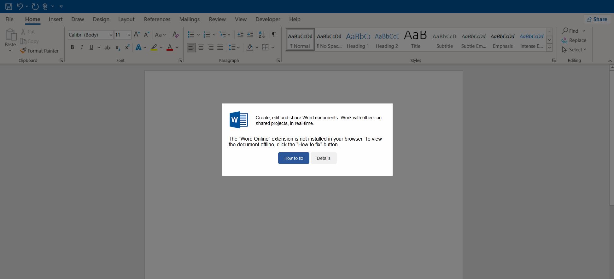


Starting to see Darkgate emails again. They're back to using AutoIt Script with some interesting twist to get there. Here's the breakdown of a sample I went through.

Email came in with a html attachment (attachment name: reports_[0-9]{6}.html):

HTML loads data to the clipboard then displays a second pages asking the users to open powershell and past: the code

Here's the data from the clipboard. Using CyberChef, I used reverse and from base64:

Which contains more base64 encoding:

Now we can see it's downloading a HTA file. Not giving any secrets away with the naming:

HTA file is downloading a zip file using powershell. In this command it also unzips the file to c:/zkdz and runs the AutoIt script:

The AutoIt script then connects to the c2, in this case dogmupdate[.]com | 94[.]158[.]244[.]112
 
<a href="https://github.com/mcsx03/mcsx03.github.io/blob/main/IOCs/2024_05_02_DarkGate">Link to IOCs</a>
 