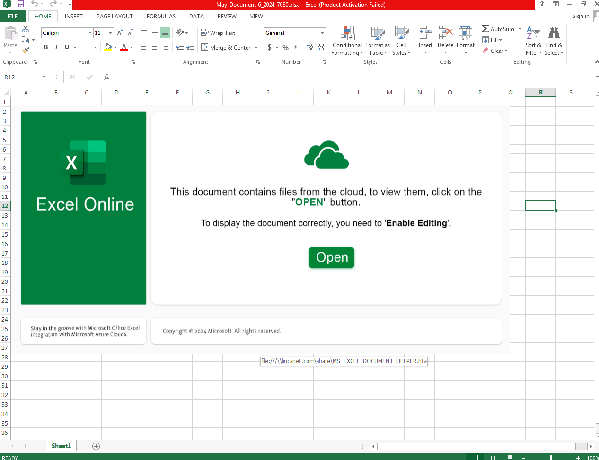


DarkGate switched back to XLSX files yesterday. Here are a few screenshots.

Emails came in with XLSX attachment matching the pattern: may-document-6_2024-[0-9]{4}.xlsx

XLSX contained a smb link:

Link downloads a HTA file(From here it's pretty much a repeat of last weeks):

HTA runs a Powershell script, which pull down a second part of the script:

 
Files are unzipped to and ran from C:/rlrh. The AutoIt script then connects to the C2 server findyourbackups[.]com
 
<a href="https://github.com/mcsx03/mcsx03.github.io/blob/main/IOCs/2024_05_06_DarkGate">Link to IOCs</a>
 