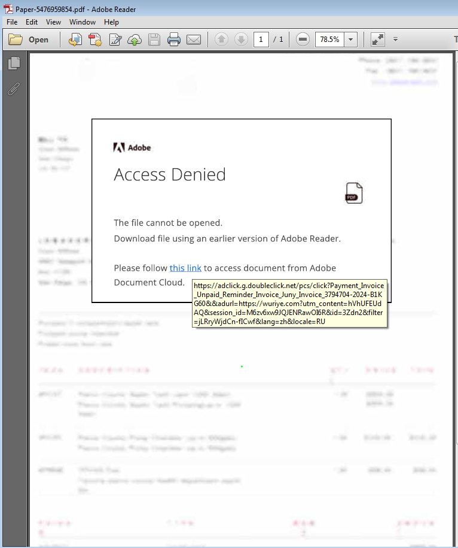
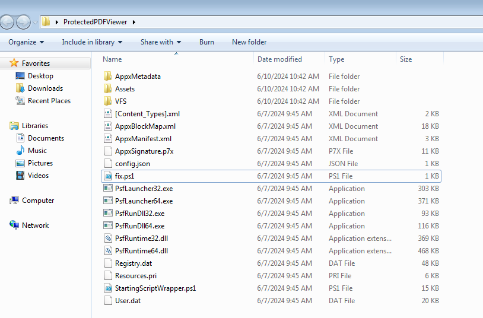
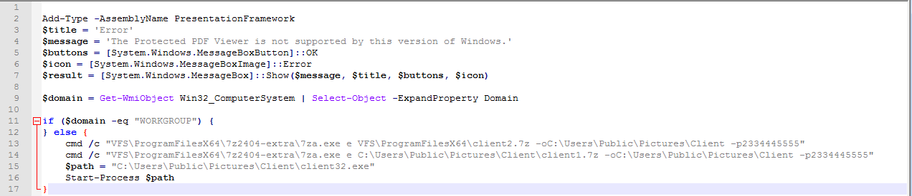
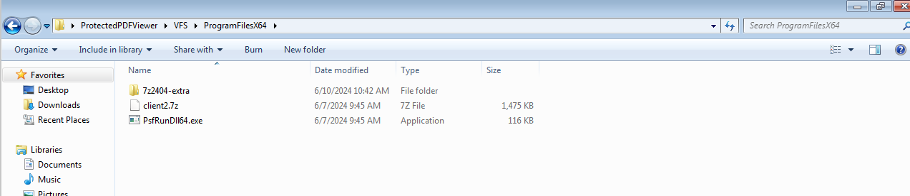
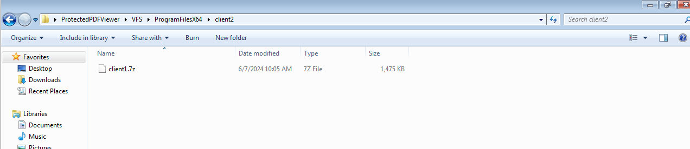
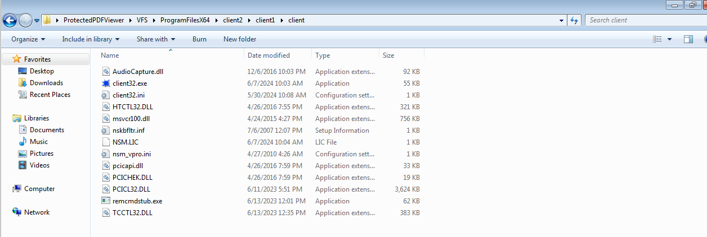
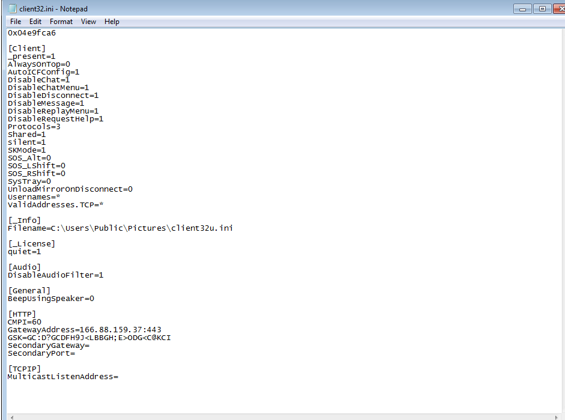


More NetSupport activity today. Emails now include PDF attachments with classic adclick URLs, downloading an MSIX file. The MSIX contains a PowerShell script that unzips a double password-protected file to the NetSupport executable. Screenshots below.

PDF
 

 
Extracted MSIX
 

 
Powershell script, both file are using the same password
 

 
First password protected zip
 

 
Second password protected zip
 

 
Netsupport Files
 

 
Config file, same gateway address as before
 

 
 
<a href="https://github.com/mcsx03/mcsx03.github.io/blob/main/IOCs/2024_06_10_Netsupport">Link to IOCs</a>
 