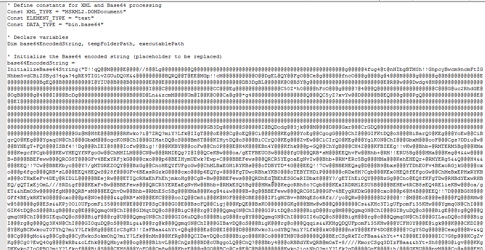


Started seeing AgentTesla emails with HTML attachments. The HTML contains Base64-encoded VBE, which prompts a download when opened. The VBE has a Base64-encoded executable that delivers AgentTesla. These are interesting as they do not require a connection between the email and infection. The initial HTML file seems to be a template for delivering LNK files. Below are screenshots of the sample I analyzed.

Email
 

 
HTML File
 

 
Prompts to download VBE
 

 
VBE contains an obfuscated executable.
 

 
Obfuscation is a simple replacement of characters.
 

 
After doing the find/replace, we can see the TVq, which is the base64 for the MZ header.
 

  

 
After unpacking the EXE, we can see the config as well as the C2.
 

 
<a href="https://github.com/mcsx03/mcsx03.github.io/blob/main/IOCs/2024_06_12_AgentTesla_VBE">Link to IOCs</a>
 