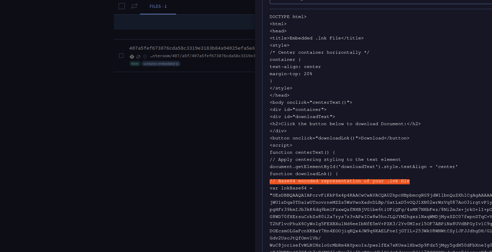
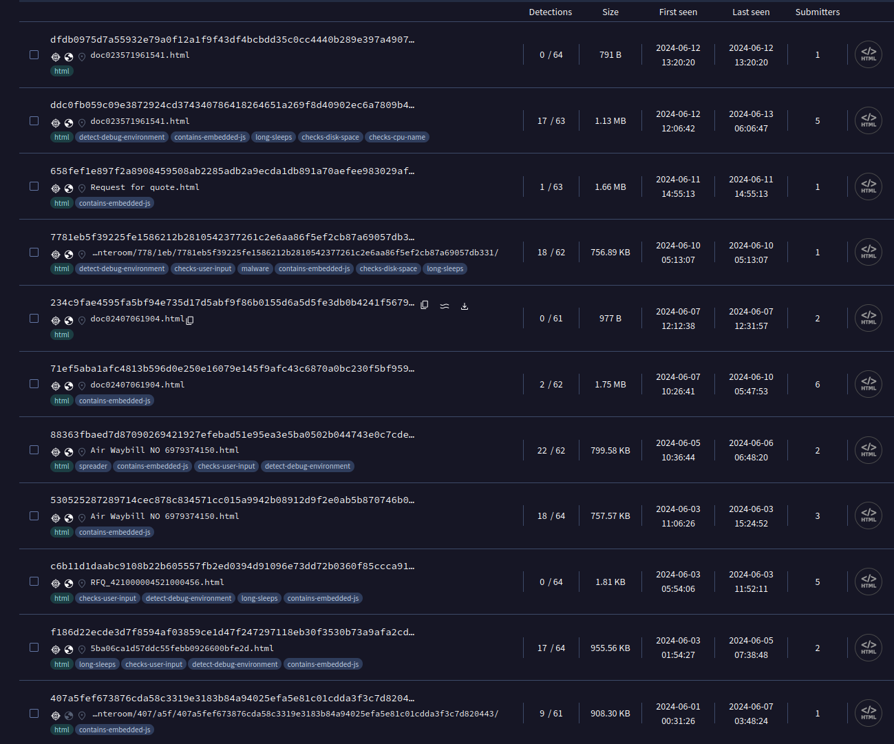
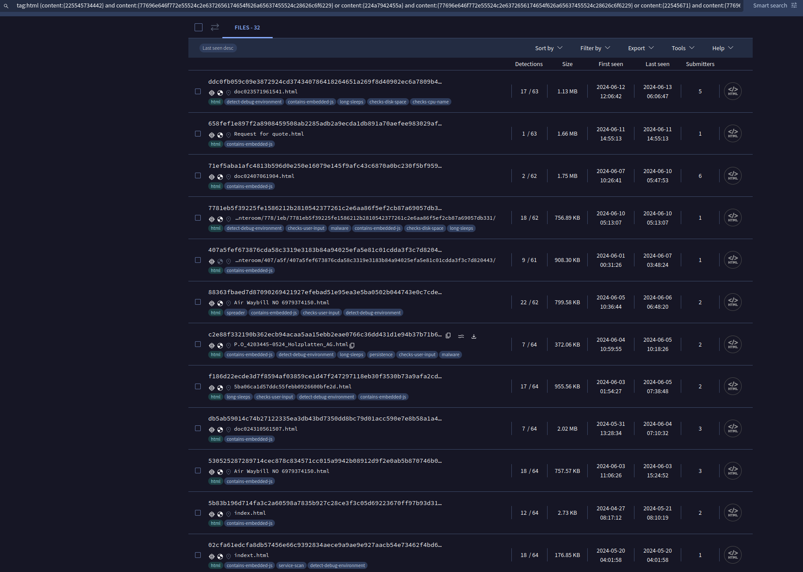
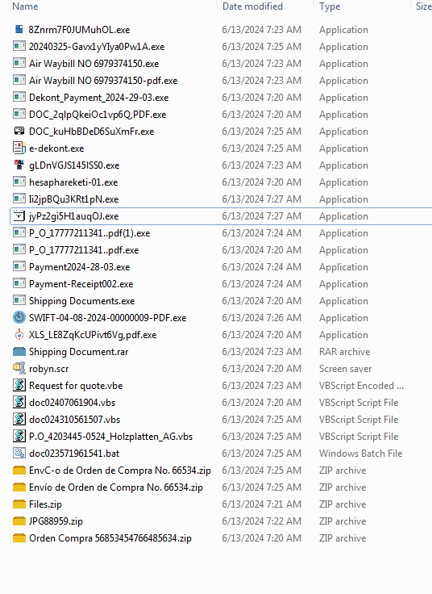
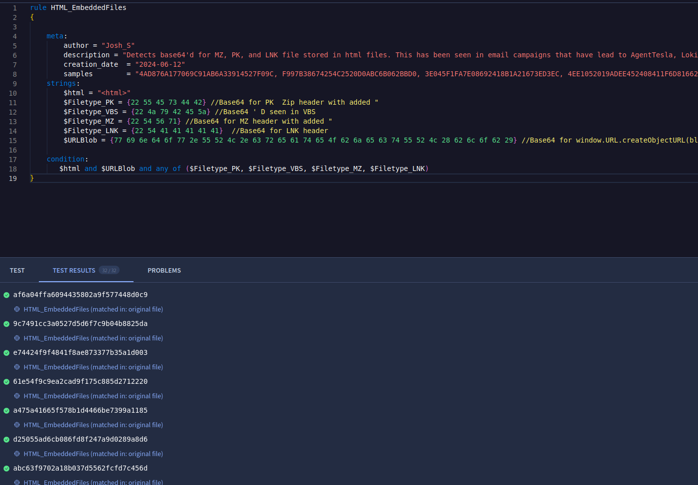


I analyzed AgentTesla on "2024-06-12" and expanded my investigation by searching VirusTotal. This led me to discover more samples, enabling me to create a YARA rule for detection. Here's a breakdown of my process and a link to the YARA rule.

Since the HTML file appeared to be a template, I decided to search for some of the HTML comments.Unfortunately, this only found one result.
 

 
Taking a different approach, I searched for HTML files containing the string 'var len = binaryString.length'. While this did return a lot of results, several were not related.
 

 
After going through several of the returned samples, I observed a consistent pattern: the presence of 'window.URL.createObjectURL(blob)' and specific types of base64-encoded content. Based on this, I created the following VirusTotal search query:
<i>tag:html (content:{225545734442} and content:{77696e646f772e55524c2e6372656174654f626a65637455524c28626c6f6229} or content:{224a7942455a} and content:{77696e646f772e55524c2e6372656174654f626a65637455524c28626c6f6229} or content:{22545671} and content:{77696e646f772e55524c2e6372656174654f626a65637455524c28626c6f6229})</i>
 

 
I decided to do what any crazy analyst would do: download all 32 samples and analyze them. Most of them led to AgentTesla, with a few instances of Lokibot and AsyncRat mixed in.
 

 
At this point, I felt the search had reached a stage where I could turn it into a Yara rule. I based this rule off the VT search I created. After testing the rule against the 32 samples, I confirmed its detection capabilities.
 

 
<a href="https://github.com/mcsx03/mcsx03.github.io/blob/main/Yara/HTML_EmbeddedFiles.yara">Link to IOCs</a>
 