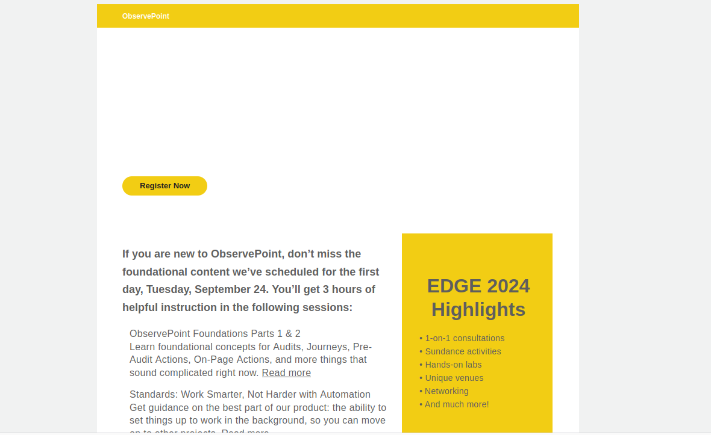
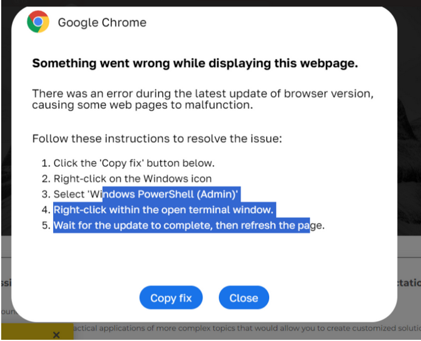
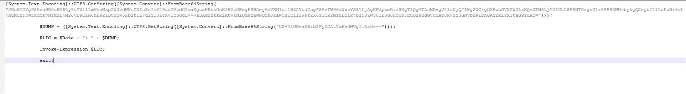
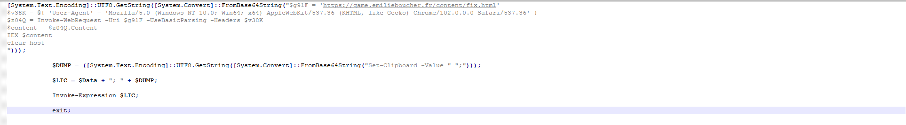
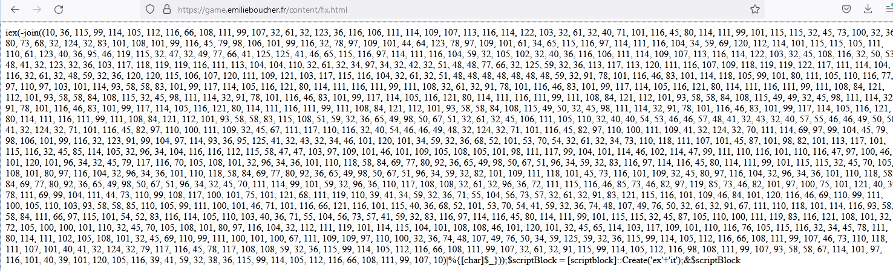
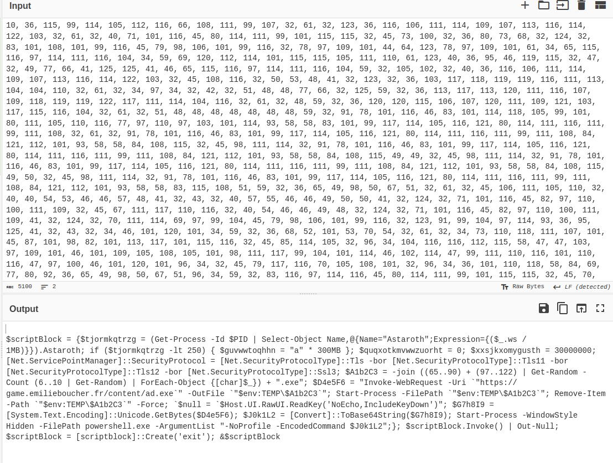


Today, we encountered several emails linked to LummaStealer. The emails contained a link that prompted the user to "fix" the webpage, copying a PowerShell command to the clipboard. The user was then instructed to open PowerShell as an admin, paste, and run the command. We initially seen this method delivering Darkgate and then Netsupport, is now being used for LummaStealer. Below is the breakdown of this sample.

Email with link to go[.]observepoint[.]com.
 

 
The link prompts the user to perform a "fix". 
 

 
Once "Copy fix" is clicked, it copies the data below to the clipboard.
 

 
Below is the decoded base64, where we can see it reaching out to a site to fetch additional code.
 

 
The code from the site is converting from charcode.
 

 
Decoded, we can see it downloading the LummaStealer payload (ad.exe). This payload is saved to the %temp% directory with random characters of [A-z]{6,10.exe}.
 

 
Then, it injects the payload into bitlockertogo.exe, establishing a connection to the C2. C2s have been documented in the IOC link below.

 
<a href="https://github.com/mcsx03/mcsx03.github.io/blob/main/IOCs/2024_06_13_Lumma">Link to IOCs</a>
 