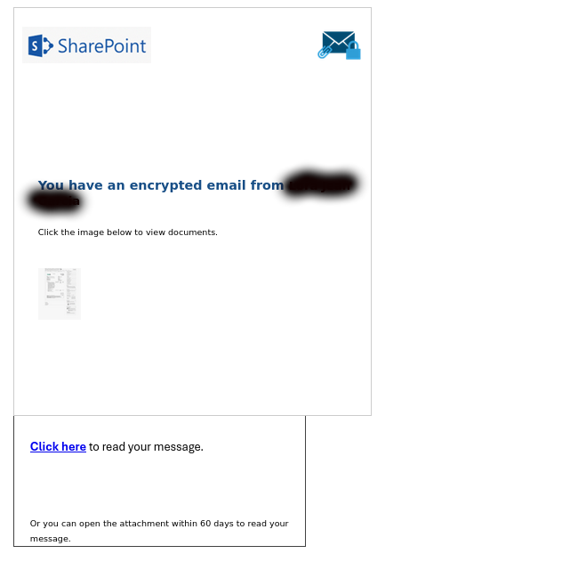
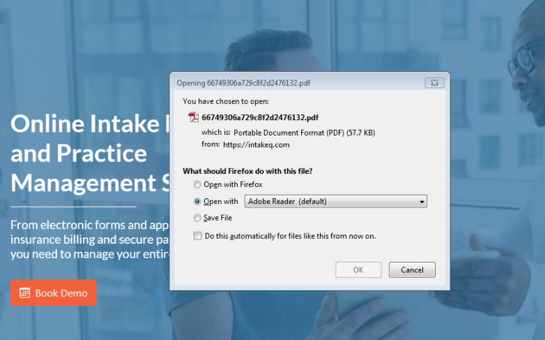
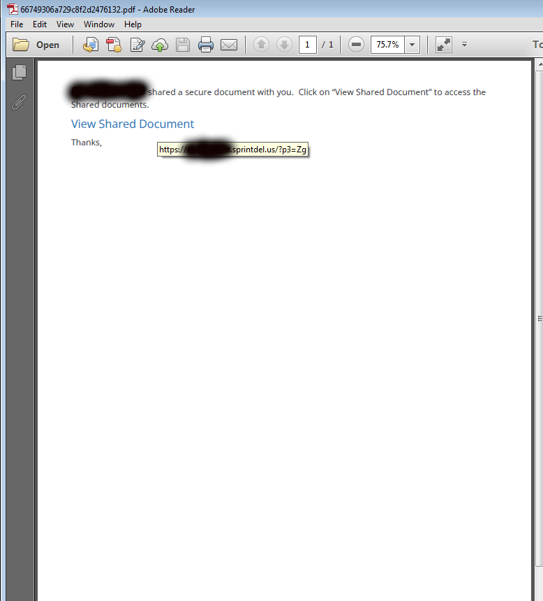
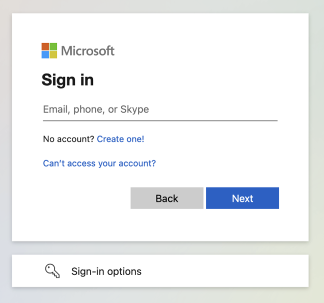
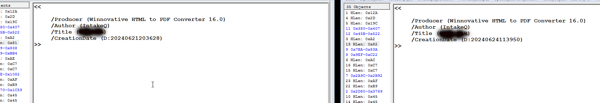
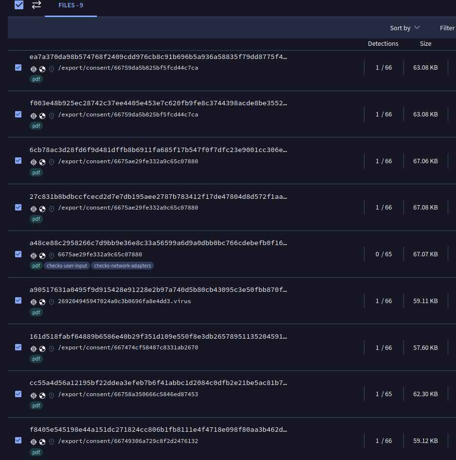
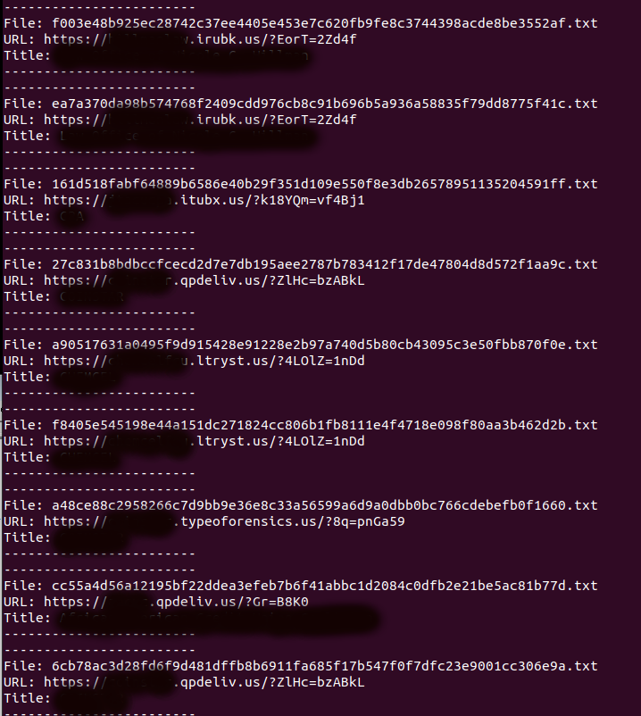
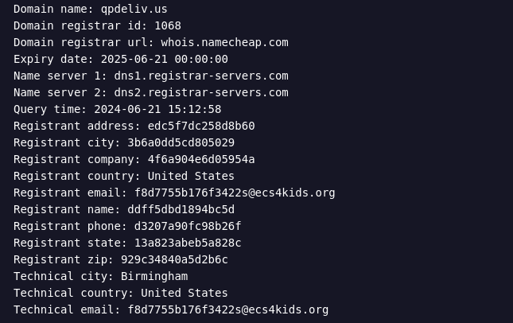
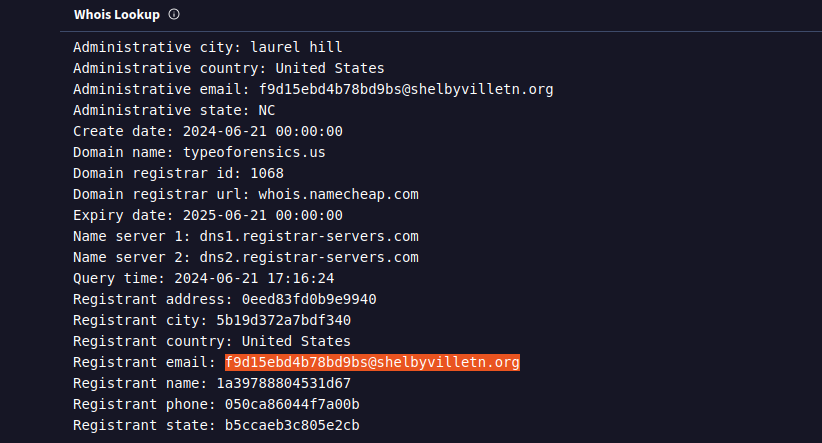
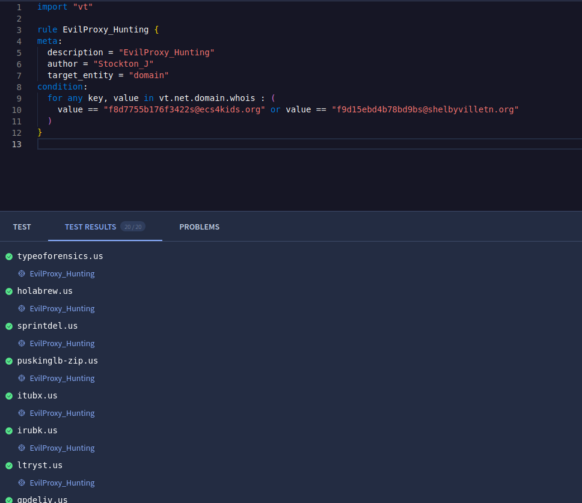


Not really malware, but I've always enjoyed keeping tabs on EvilProxy. Malware campaigns have slowed down, so I decided to write a quick blurb on the recent switch to IntakeQ distribution. I'll start with a recent email we received and go over how I hunt for new domain creation. From what I've observed, these are being sent from a compromised account, because of this I'll keep the company names hidden.

The email usually comes in with the compromised company's name as the subject and claims to have an encrypted message that will take the user to a landing page. In this example, it uses an IntakeQ link.
 

 
The link prompts the user to open a PDF.
 

 
The PDF contains a link, usually with a lookalike subdomain for the compromised user's company.
The link then takes you to the phishing page.
 

 

 
Looking at a few of these PDFs, I noticed they all contained the author "IntakeQ" and the title of the company they were made for.
 

 
I used the author string to search VirusTotal for more samples. Unfortunately, it only returned nine results. All which had extremely low detections.
 

 
I downloaded the files and wrote a quick script to extract the URL and title.
 

 
From here, I started to pivot off the registrant email address f8d7755b176f3422s@ecs4kids[.]org (sonya.wright@ecs4kids[.]org).
 

 
This returned a valuable search to keep tabs on. All but one of the found domains were registered by this user.
 

 
Looking at the other domain, it was registered by f9d15ebd4b78bd9bs@shelbyvilletn[.]org (randy.carroll@shelbyvilletn[.]org). After looking at domains with the same registrant email, it returned another list of blockable domains.
 

 
Lastly, I created a new VirusTotal live hunt to monitor for activity.
 

 

<a href="https://github.com/mcsx03/mcsx03.github.io/blob/main/Yara/EvilProxy_VT.yara">Link to Yara rule.</a>
 