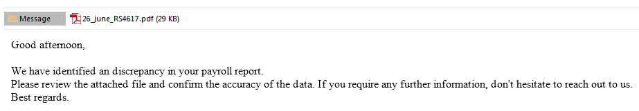
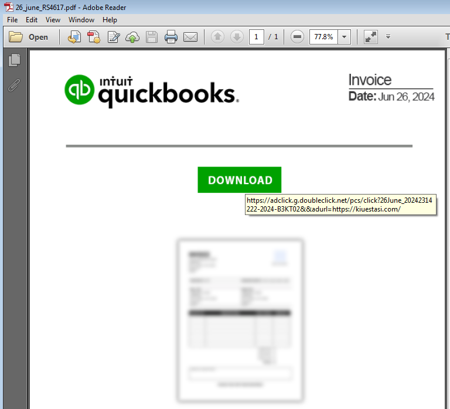
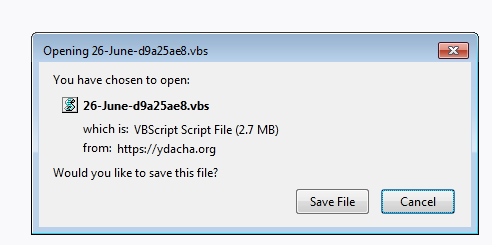
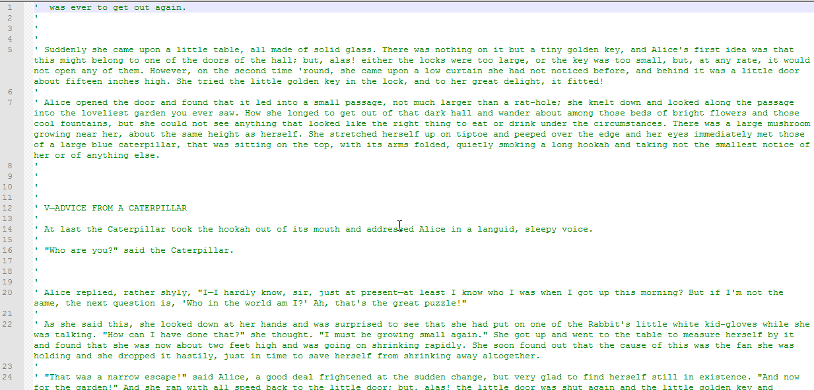
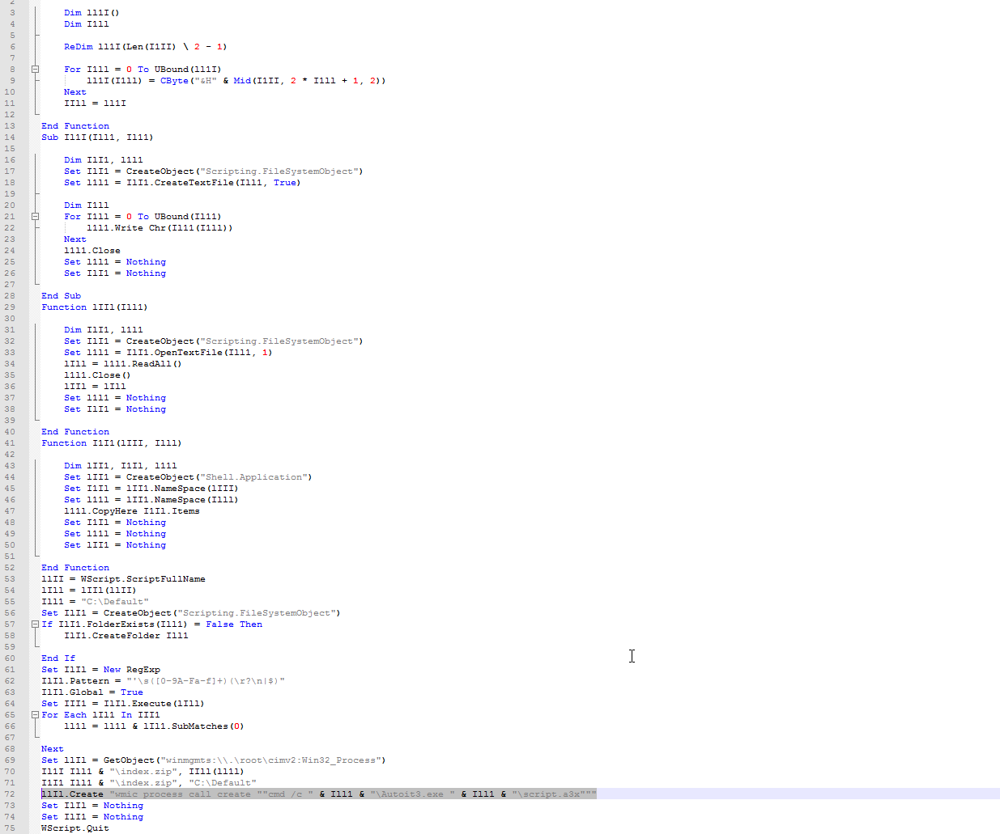
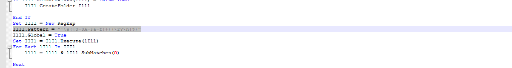
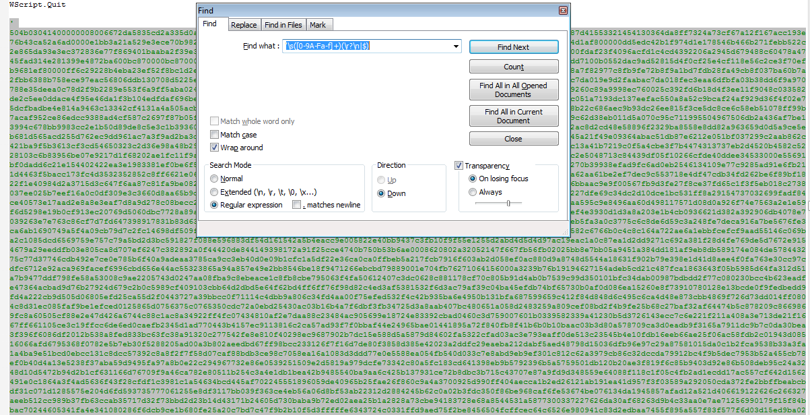
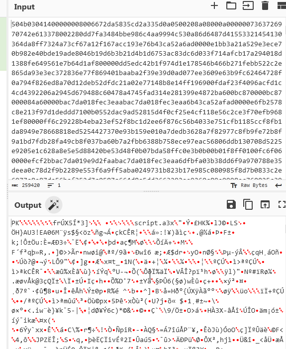
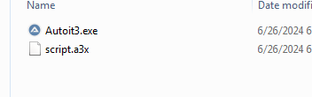
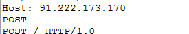


Seeing DarkGate again, using PDF attachments that download a VBS file. The VBS file contains an encoded zip file with the AutoIt executable and AutoIt script. Here are a few screenshots and IOCs from today's campaign.

The email had an HTML attachment. All attachments followed the pattern 26_june_[A-z]{2}[0-9]{4}.pdf.
 

 

PDF - Still using adclick links
 

 

VBS
 

 

The VBS script is obfuscated with random comments.
 

 

After removing the comments, the script's intent becomes clearer.
 

 

However, it's searching for a commented section that contains a hexadecimal string.
 

 

I re-added the comments and located the embedded zip file.
 

 

 

The ZIP file contained the AutoIt executable and the AutoIt script.
 

 

The script then connect to the C2.
 

 
<a href="https://github.com/mcsx03/mcsx03.github.io/blob/main/IOCs/2024_06_26_DarkGate">Link to IOCs</a>
 