
Recently, I've noticed emails containing links, attachments, or both, leading to a combination of XWorm, AsyncRat, and Remcos. These threats use multiple layers of obfuscation, involving data mapping and the Early Bird technique. Below are some screenshots of my analysis process, a link to IOCs, and a script I created to decode some of the layers.

The starting point is an email containing a PDF attachment, alongside links to ZIP files.
 
<a href="Screenshots/XA1.png"> 
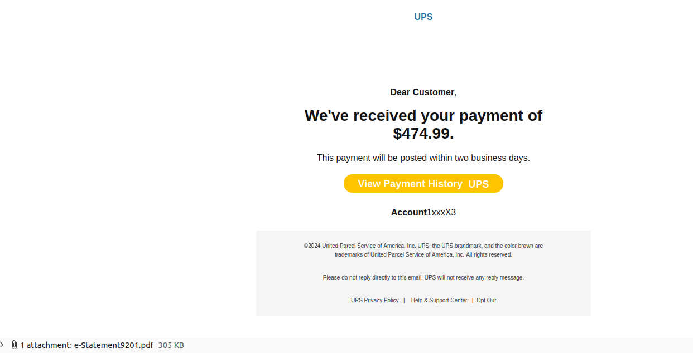
</a>
 
PDF which contained the link.
 
<a href="Screenshots/XA2.png"> 
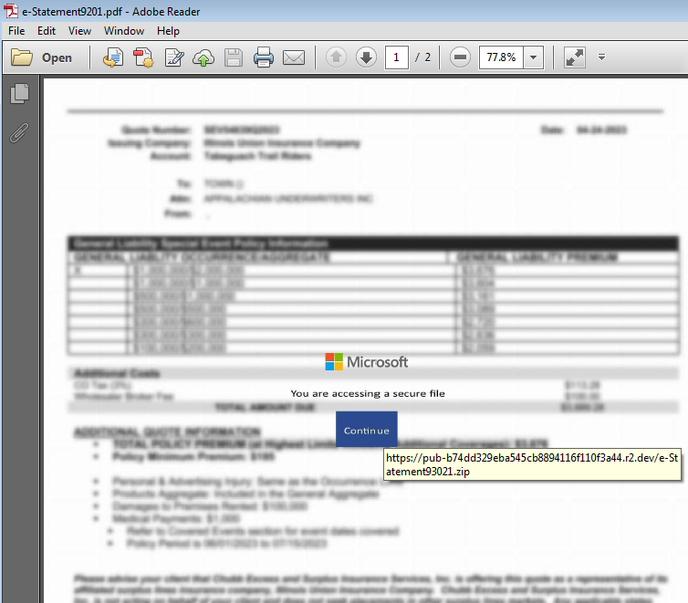
</a>
 

Link Downlods ZIP file.
 
<a href="Screenshots/XA2_1.png"> 
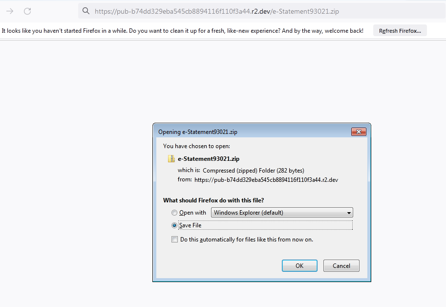
</a>
 

ZIP file contains URL file
 
<a href="Screenshots/XA4.png"> 
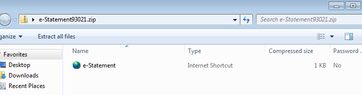
</a>
 

Which then goes to a LNK file
 
<a href="Screenshots/XA5.png"> 
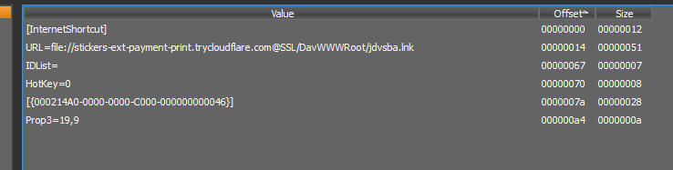
</a>
 

Upon examining the site, several files stand out. Interestingly, multiple sites share identical file names and structures. This could lead to an fun hunt in the future.
 
<a href="Screenshots/XA6.png"> 
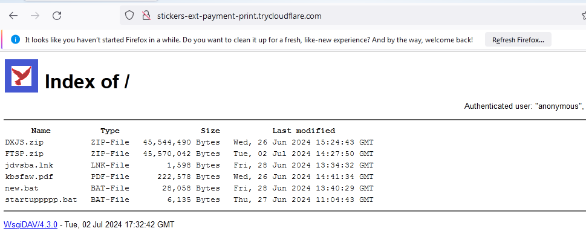
</a>
 

LNK file pulls down new.bat.
 
<a href="Screenshots/XA6_.png"> 
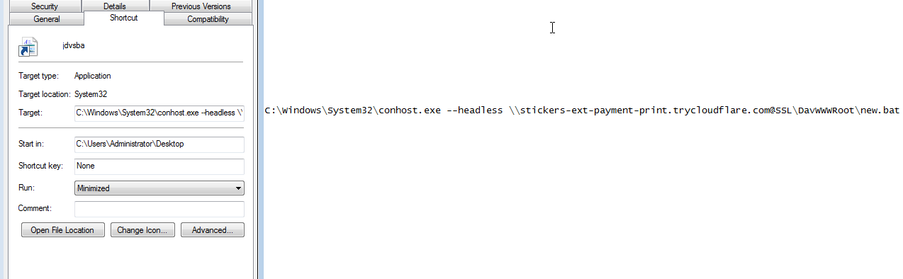
</a>
 
Obfuscated batch file. 
 
<a href="Screenshots/XA7.png"> 
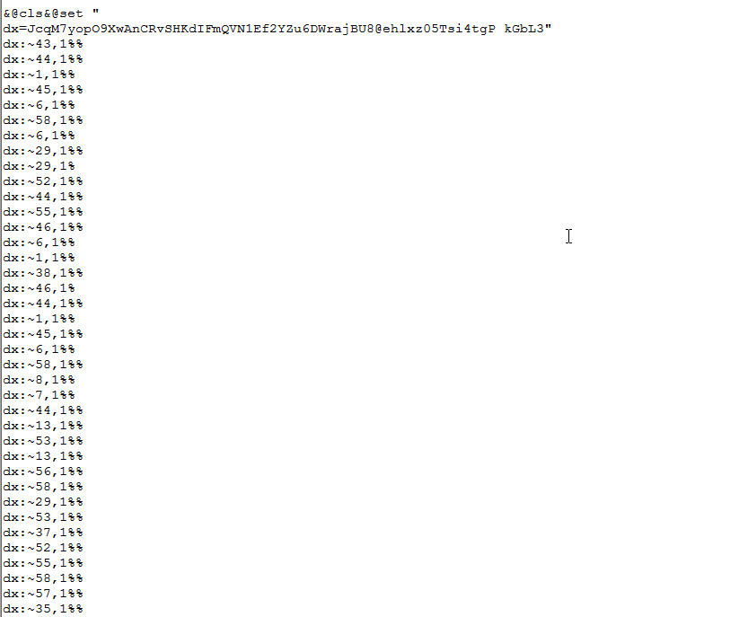
</a>
 

I've encountered several instances of these threats, all following the same format, so I decided to create a Python script to handle them (link below). They use data mapping by setting a key string and then creating another string based on character positions within that key string. 
    - Download a PDF from their site (which does nothing significant). 
    - Download two ZIP files, extract their contents, and delete the ZIP files. 
    - Download startupppp.bat and place it in the startup menu. 
Each ZIP file contains a Python executable along with six Python scripts. The script runs the first six scripts: money.py, moment.py, update.py, upload.py, time.py, and kam.py.
 
<a href="Screenshots/XA8.png"> 
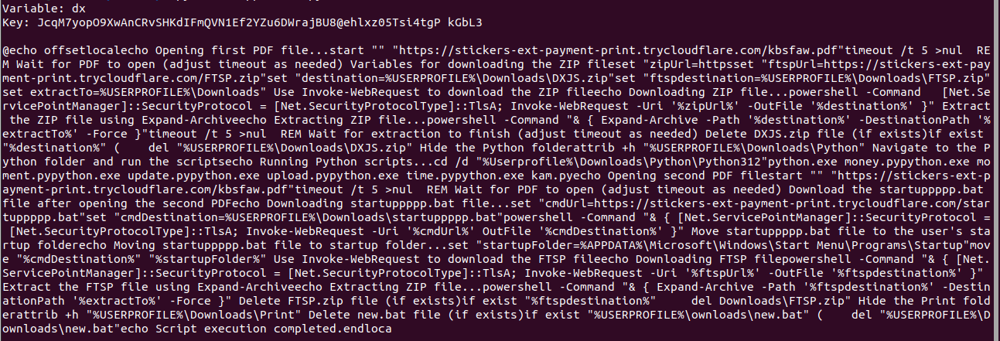
</a>
 
Examining startuppppp.bat file, it has the same obfuscation as new.bat. Using the script again, we can see that startuppppp.bat is mostly just cleaning up and running the other six Python scripts: 1.py, 2.py, 3.py, 4.py, 5.py, and 6.py.
 
<a href="Screenshots/XA9.png"> 
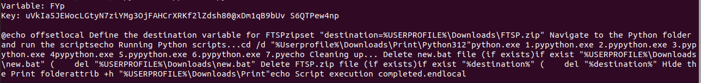
</a>
 
After inspecting the Python scripts, they are all nearly identical. Each script contains a Base64 string, a key, and a decryption function.
I modifed their code slighty to write the output to a file.
 
<a href="Screenshots/XA10_.png"> 
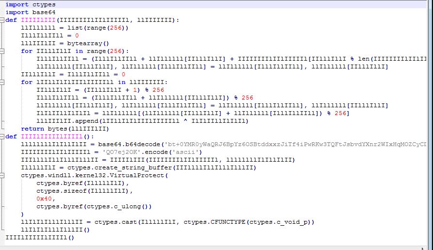
</a>
 

<a href="Screenshots/XA11.png"> 
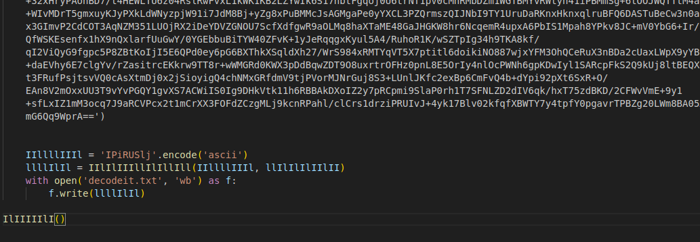
</a>
 
Looking at the output of several of these scripts, they all appear to be shellcode. After uploading them to VirusTotal, they all were flagged as Donut shellcode.
 
<a href="Screenshots/XA12.png"> 
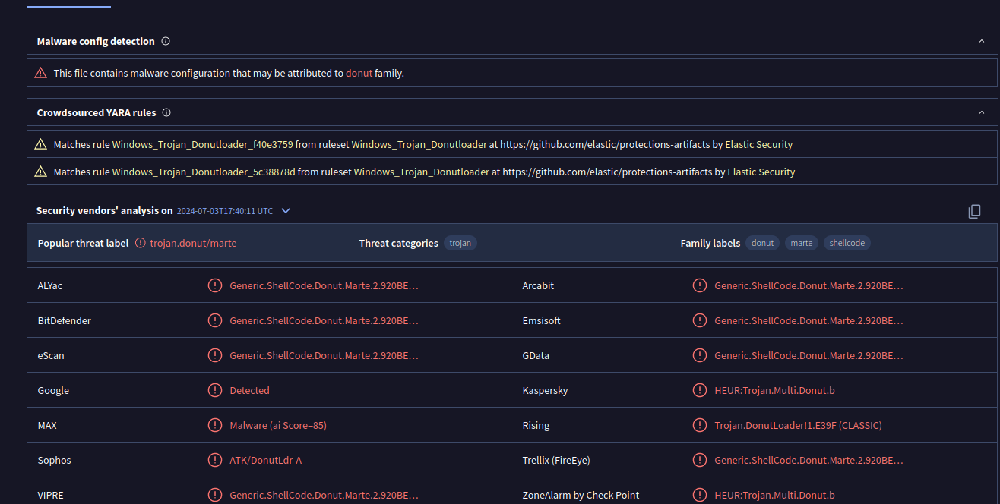
</a>
 
Once running, the threat actors did not try to hide much. They used the Early Bird APC technique to inject the shellcode into Notepad.exe.
 
<a href="Screenshots/XA10.png"> 
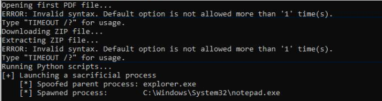
</a>
 
<a href="Screenshots/XA13.png"> 
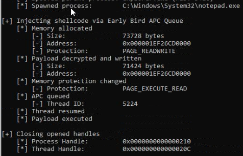
</a>
 
Finally analyzing the injection of notepad.exe, it appeared to be XWorm and AsyncRat. This was later confirmed by Triage. <a href="https://tria.ge/240703-tlv6nsyele/behavioral2"> Hatching Triage Report </a>

 
 
<a href="https://github.com/mcsx03/mcsx03.github.io/blob/main/IOCs/2024_07_03_Xworm_AsyncRat">Link to IOCs.</a>
 
<a href="https://github.com/mcsx03/mcsx03.github.io/blob/main/Scripts/BatchDecode.py">Link to script.</a>
 
