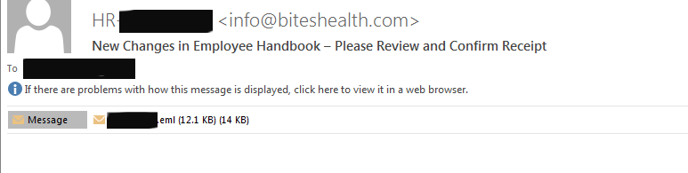
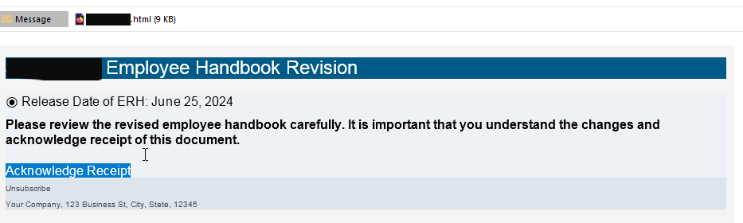
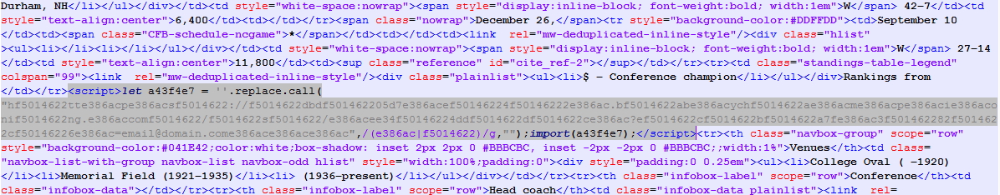
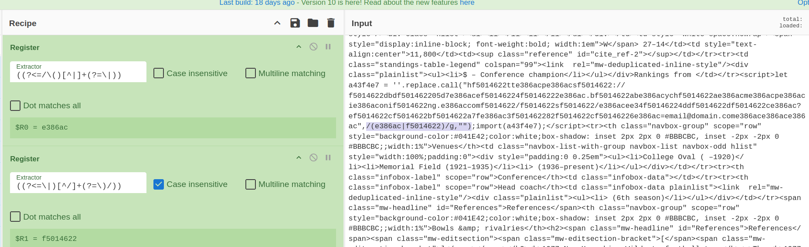
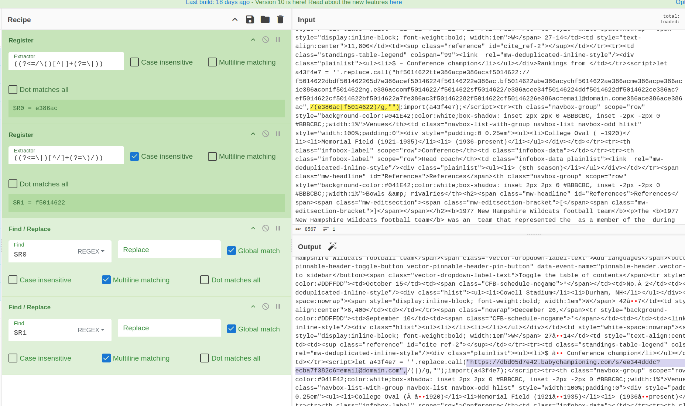
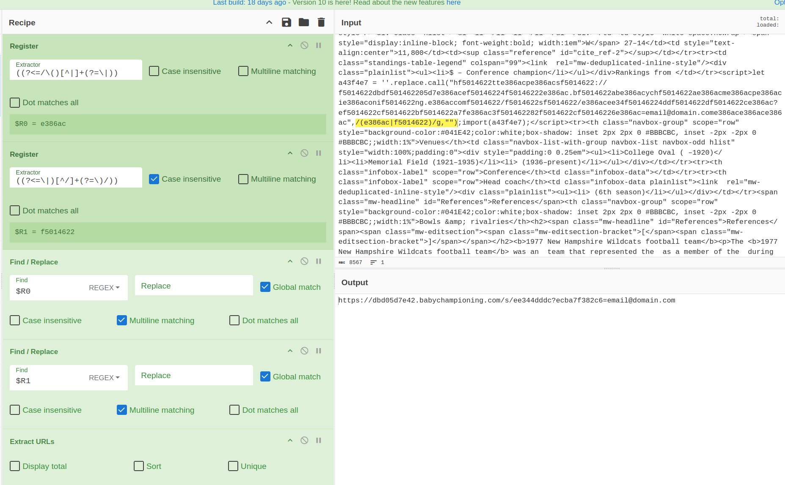
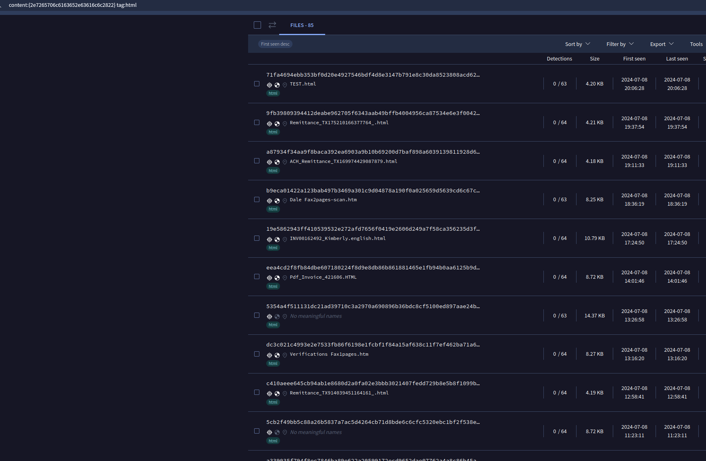
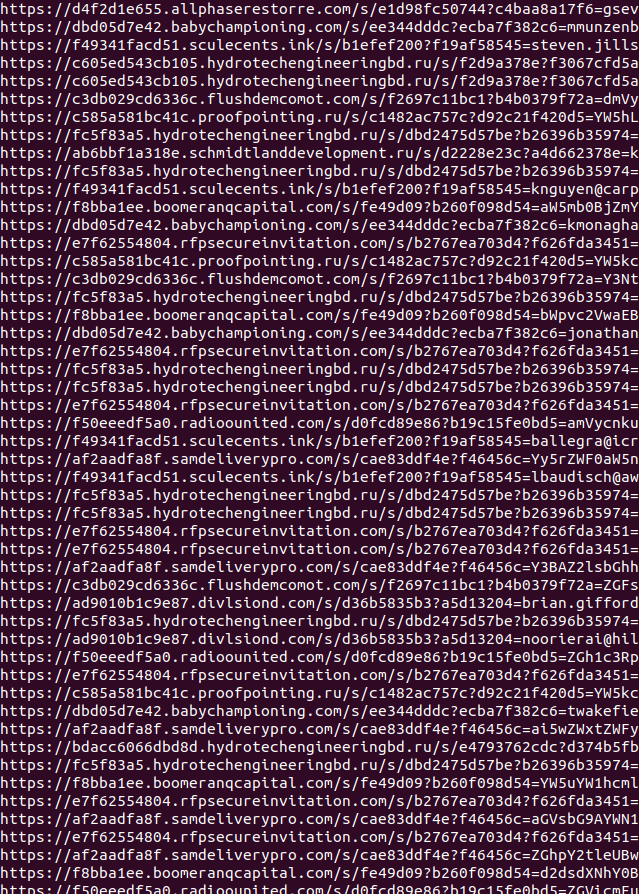
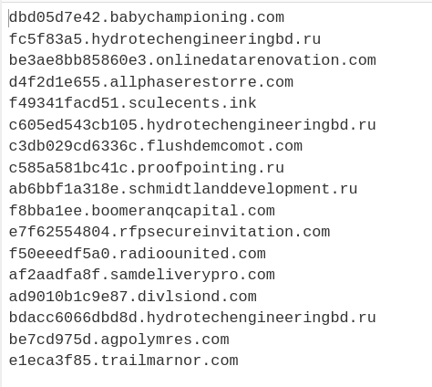


A few days ago, we received several phishing emails with EML attachments that contained HTML files. This method isn't new to us, but needing a break from AgentTesla samples, I decided to investigate further. The HTML files utilized a straightforward Replace.Call command to decode the URL embedded within. Upon searching common strings on VirusTotal, it appears these files have been circulating since May 22, 2024. Below is a concise overview of my investigative process, along with a CyberChef recipe and a Python script used to extract the URL.

Initial Email with EML Attachment (companyname.eml)
 

 

EML Attachment with HTML File (companyname.html>)
 

 

Here is the snippet where it constructs the URL by replacing strings in "a43f4e7". For privacy reasons, I've replaced the email address with email@domain.com.
 

 

Since I enjoy using CyberChef, I found it fairly straightforward to recreate this process. The code involves finding and replacing two strings stored between "/" and "/", separated by "|", as shown in this example: "/(e386ac|f5014622)/". In CyberChef, I utilize the Register and a Regex operation to identify these two strings.
 

 

Next, I simply take the two variables and perform the find and replace operation.
 

 

Then it's just a straightforward extraction of the URL.
 

 

While that was fun, I decided to do some hunting on VirusTotal. Starting with the replace.call string, I ran a search and surprisingly found solid results when paired with the HTML tags provided. It's worth noting the extremely low VirusTotal scores for these findings.
 

 

I ran a few of these through the CyberChef recipe from earlier, which worked great. But there were still 85 samples on VirusTotal. I wanted to create a way to extract all the URLs, so I decided to mimic the CyberChef recipe with a Python script.
 

 

After removing duplicates, this returned 17 unique domains to block/detect.
 

 

 
 
<a href="https://github.com/mcsx03/mcsx03.github.io/blob/main/IOCs/2024_07_08_EML_Phihsing_Hunt">Link to IOCs.</a>
 
<a href="https://github.com/mcsx03/mcsx03.github.io/blob/main/Scripts/PhihsingDecode.py">Link to script.</a>
 

CyberChef Recipe: 
[
  { "op": "Register",
    "args": ["((?<=/\\()[^|]+(?=\\|))", false, false, false] },
  { "op": "Register",
    "args": ["(/\\([^|]+\\|)", true, false, false] },
  { "op": "Find / Replace",
    "args": [{ "option": "Regex", "string": "$R1" }, "", true, false, true, false] },
  { "op": "Find / Replace",
    "args": [{ "option": "Regex", "string": "$R3" }, "", true, false, true, false] },
  { "op": "Extract URLs",
    "args": [false, false, false] }
]