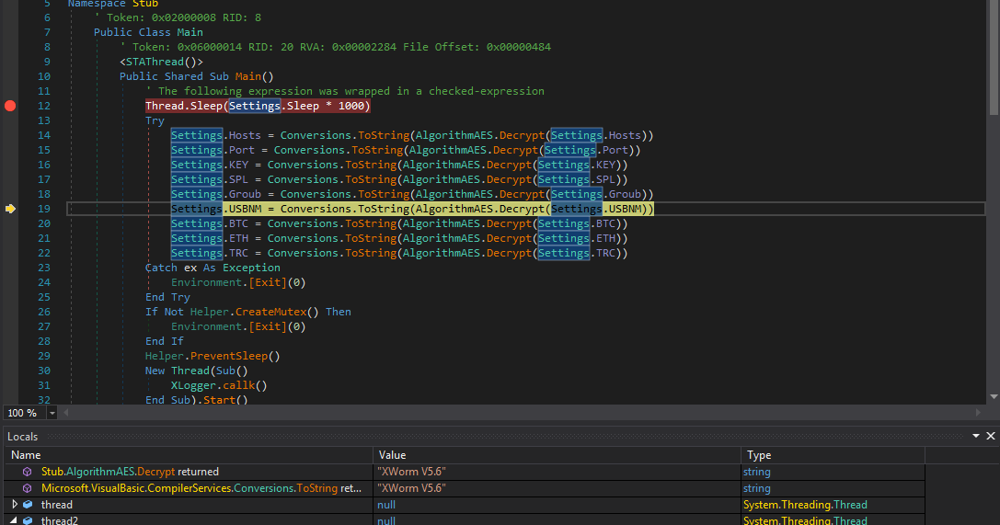


Today, I encountered an interesting Xworm sample. It started with an email containing two ZIP attachments: one a PDF and the other a LNK file. The PDF did not seem to contain anything malicious; almost like they forgot to insert the link. However, the LNK file took a few twists before finally delivering the Xworm payload. Below is a high-level overview of the steps I took to analyze the file.

Starting point, email with two ZIP attachments:
 

 

 
After finding nothing malicious in the PDF, I started looking at the LNK file. The LNK file contained a PowerShell command with a base64-encoded string.
 

 
Deobfuscating the string, I could see it's pulling data from the site 0x0[.]st.
 

 
 
The site contained additional Base64-encoded strings.
 

 
After getting this into a more readable format, I could see that it was using yet another base64-encoded string which was XOR'd. The base64 string would be decrypted, saved to the AppData folder, and then executed.
 

 
Using CyberChef, I reversed the operation, which revealed the executable.
 

 
Looking at the unpacked sample, it was preatty easy to tell it was Xworm. To get the c2, I simply set a breakpoint before it decrypted, letting it decrypted the config for me.
 

 

 
 
<a href="https://github.com/mcsx03/mcsx03.github.io/blob/main/IOCs/2024_07_31_Xworm">Link to IOCs.</a>

