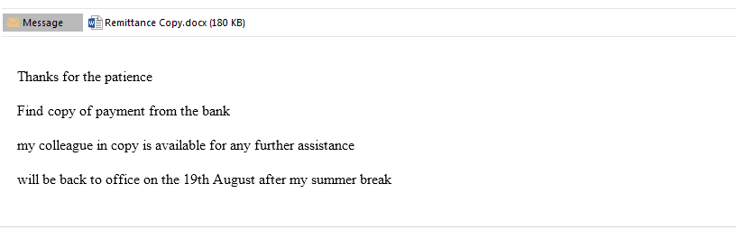
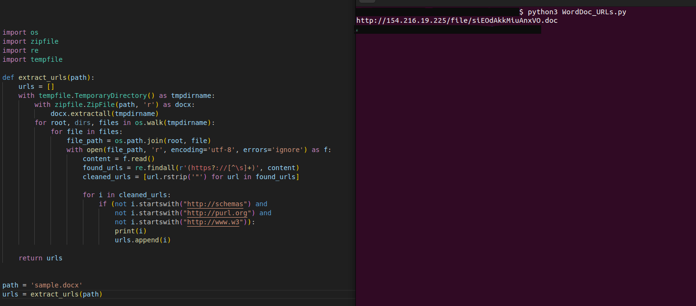
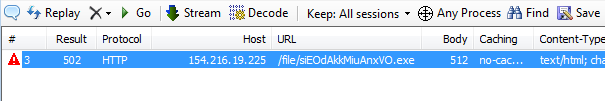
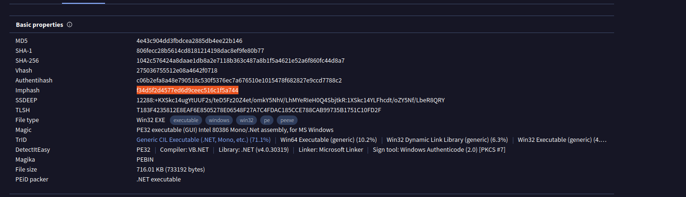
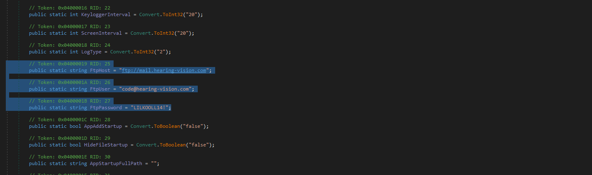


We continue to see emails circulating that use a very old technique (CVE-2017-11882) involving the Equation Editor in Word to download an executable file. Despite its age, this method is still being exploited. Here is a recent example, where a .docx attachment was used. The investigation ultimately led to the discovery of AgentTesla. Below are some of the steps I took an analyze the sample.

The starting point is an email with a .docx attachment.
 

 

A few years ago, when .docx files were widely used, I wrote a simple script to handle them. The script decompresses the .docx file and examines each extracted file for URLs. I'll provide a link to the script below. When running this script against the .docx file, it shows it downloads a .doc file.
 

 

After downloading the .doc file, I disconnect from the network and monitor connections using Fiddler. This reveals that the .doc file attempts to download an executable using the Equation Editor.
 

 

Examining the IMPHash of the executable on VirusTotal, its the classic "f34d5f2d4577ed6d9ceec516c1f5a744". This is commonly associated with delivering stealers and RATs.
 

 

After unpacking the file, we can easily view the configuration and confirm that it is AgentTesla.
 

 
 
<a href="https://github.com/mcsx03/mcsx03.github.io/blob/main/IOCs/2024_08_13_AgentTesla">Link to IOCs</a>
 
<a href="https://github.com/mcsx03/mcsx03.github.io/blob/main/Scripts/WordDocx_URLs.py">Link to Script</a>