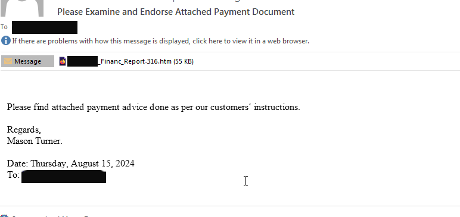
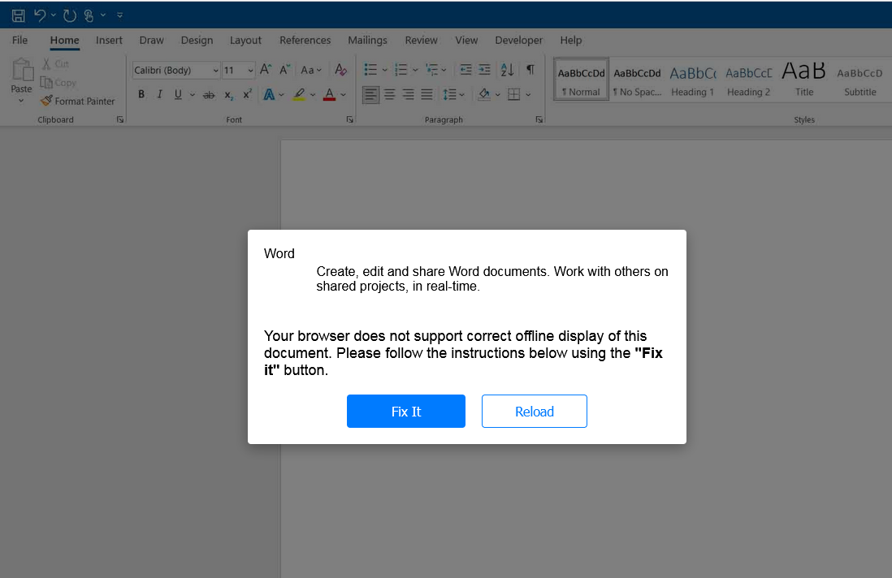
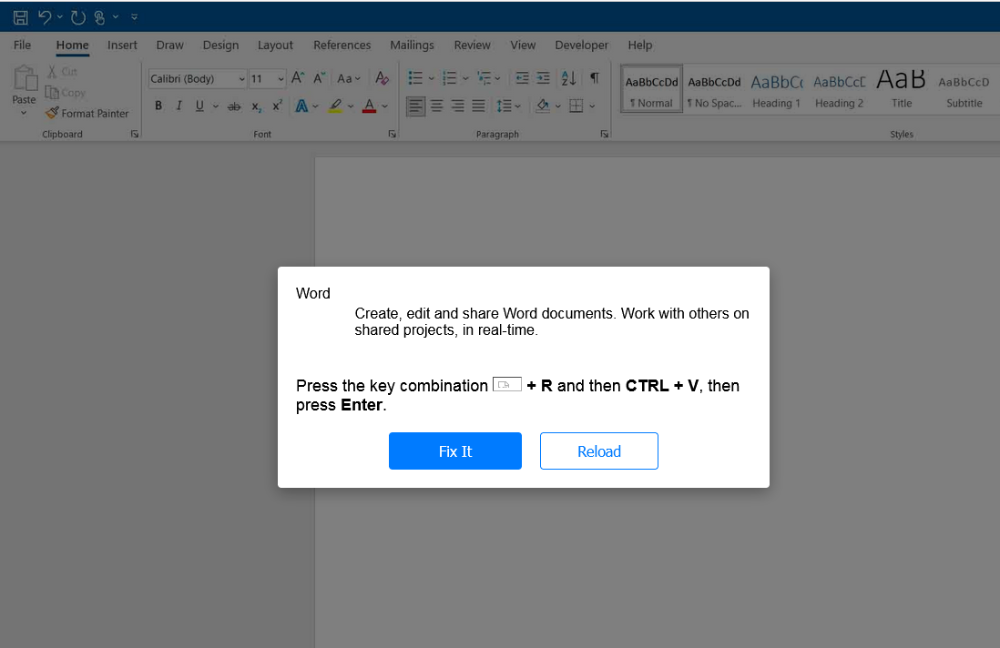
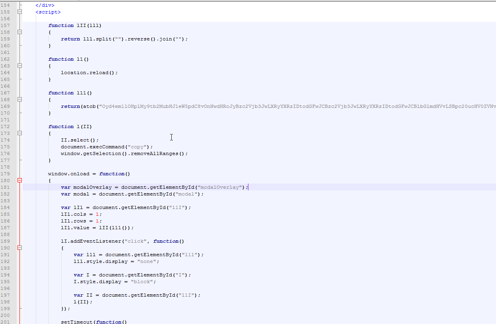
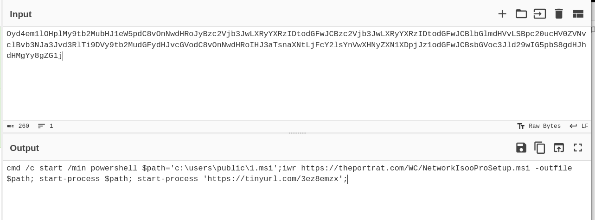
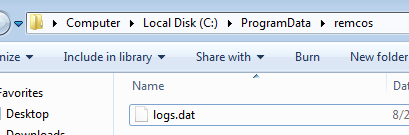
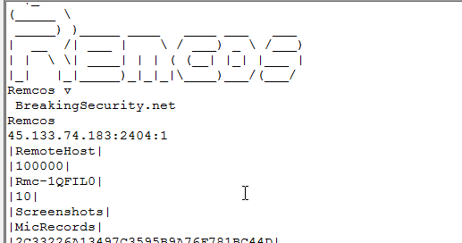


This week, we encountered several ClickFix emails leading to Remcos RAT. ClickFix emails have been circulating for a while now. The first instance I recall involved a sample that led to DarkGate. Shortly after, it was seen delivering lower-level RATs such as NetSupport, LummaStealer, and Remcos. ClickFix typically arrives via email with an HTML attachment. The HTML file displays an error message with a "fix" button. When the button is clicked, it copies a command to the user's clipboard and prompts the user to paste and run it. Below are some screenshots of a recent sample I analyzed.

Starting point: an email with an HTML attachment.
 

 
HTML File.
 

 
 

 
When examining the HTML file in Notepad++, we can see the command it decodes and reverses.
 

 
I simply throw this into CyberChef to view the output (pasting the command after running the HTML will also reveal this data). It’s pretty straightforward: it uses PowerShell to download an MSI from theportrat[.]com to `users\public\1.msi`. It then runs this MSI, along with a file from a shortened URL. The TinyURL is just a dummy PDF file.
 

 
The MSI performs several actions. It extracts an executable to `AppData\Local\Programs\Network MPluginManager\Coolmuster PDF Image Extractor.exe` and also runs a few commands to add firewall rules and set exclusion paths for the executable:

*   _C:\Windows\system32\cmd.exe /c powershell -inputformat none -outputformat none -NonInteractive -Command Add-MpPreference -ExclusionPath "C:\Users\<username>\AppData\Local\Programs\Network MPluginManager\Coolmuster PDF Image Extractor.exe"_

*   _netsh advfirewall firewall add rule name="Coolmuster PDF Image Extractor In Service" dir=in action=allow program="C:\Users\Admin\AppData\Local\Programs\Network MPluginManager\Coolmuster PDF Image Extractor.exe" enable=yes_

*   _netsh advfirewall firewall add rule name="Coolmuster PDF Image Extractor Out Service" dir=out action=allow program="C:\Users\Admin\AppData\Local\Programs\Network MPluginManager\Coolmuster PDF Image Extractor.exe" enable=yes_

Keylogged data is saved to `ProgramData/remcos/logs.dat`.
 

 
Remcos C2 - 
 

 