
This week, while reviewing email campaigns, I came across an interesting sample leading to njRAT. Although we’ve seen njRAT campaigns off and on in the past, this is the first one we've encountered in a while.The campaign begins with an email containing a Google Drive link that downloads a VBS file. From there, it takes several steps to execute. Below, I’ve outlined some of my notes and included screenshots from my analysis of this campaign.

The campaign starts with an email containing a Google Drive link, which downloads a VBS file intentionally made large enough to bypass Google’s virus scan.
 
<a href="Screenshots/njrat1.png"> 
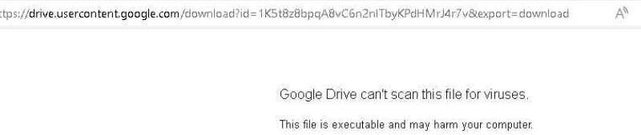
</a>
 

Upon examining the VBS, I found it contained nearly 3,000 lines of code. I began by removing the commented-out lines using the regex `^\s*'.*$`.
 
<a href="Screenshots/njrat2.png"> 
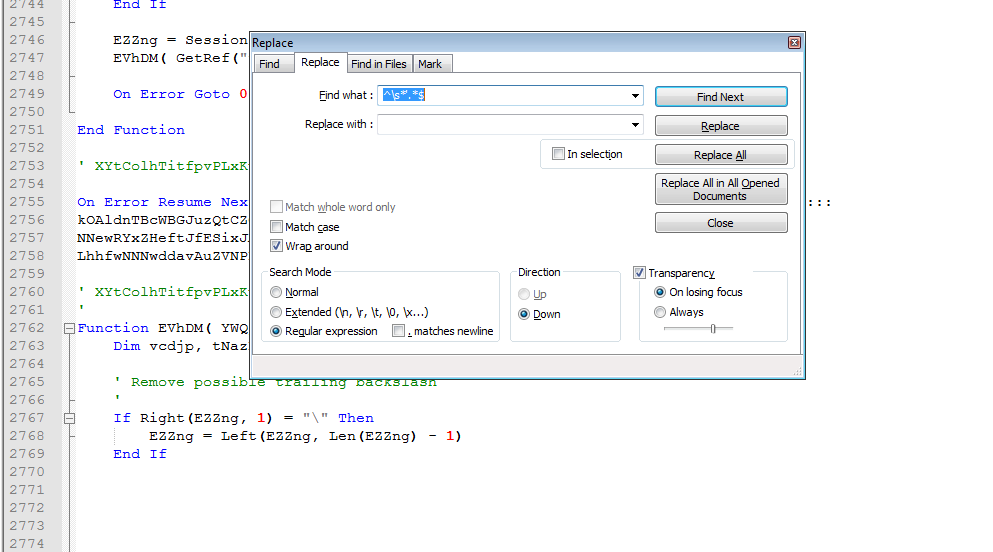
</a>
 

This reduced the code to around 2,000 lines. As I continued reviewing it, I noticed several repeated lines. After removing all the duplicates, I was left with just 23 lines, which was much easier to work with. At a glance, I could tell it likely deobfuscates some Base64 code and executes it using PowerShell.
 
<a href="Screenshots/njrat3.png"> 
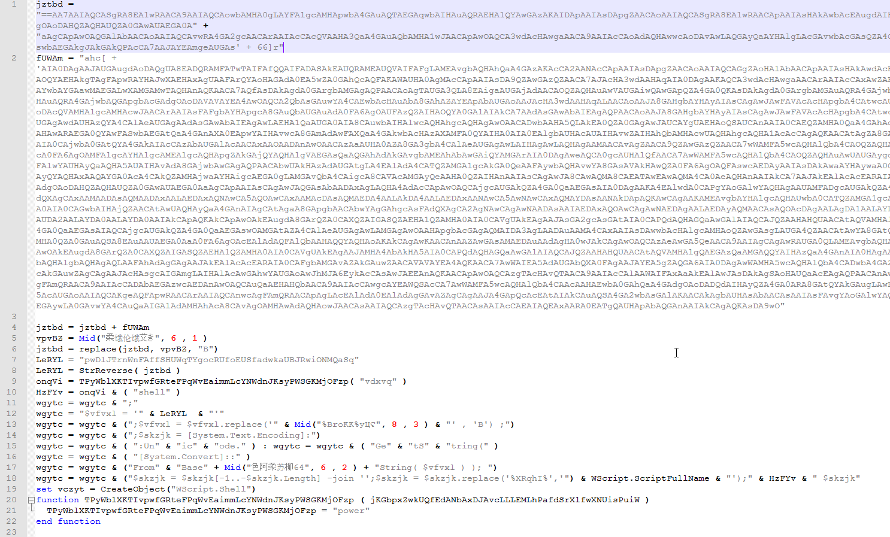
</a>
 
To make things easier, I simply modified their run command with an echo. This allowed me to get a clearer picture of what was happening.
 
<a href="Screenshots/njrat4.png"> 
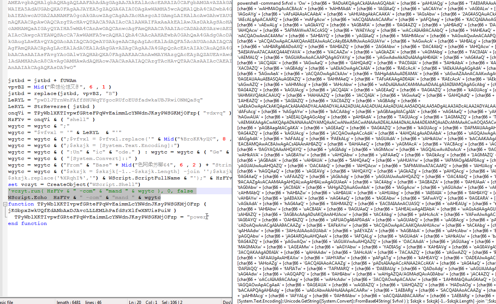
</a>
 
This confirmed what I suspected was happening. I then jumped over to CyberChef to finish decoding.
 
<a href="Screenshots/njrat5.png"> 
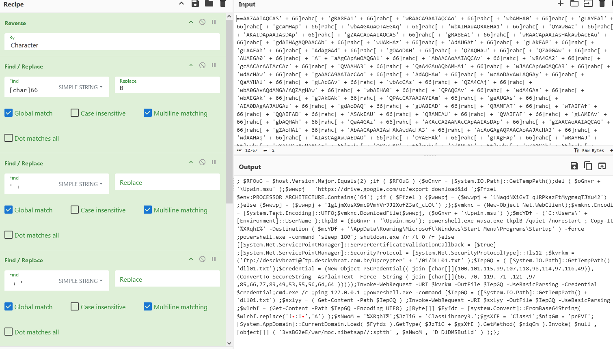
</a>
 
At this point, several things are happening. First, the script checks the version of PowerShell. If the version is 2, it downloads a new package from a Google Drive link, selecting the appropriate version based on the processor architecture. After the installation, it copies the script to the startup folder and then restarts the machine.
 
<a href="Screenshots/njrat6.png"> 
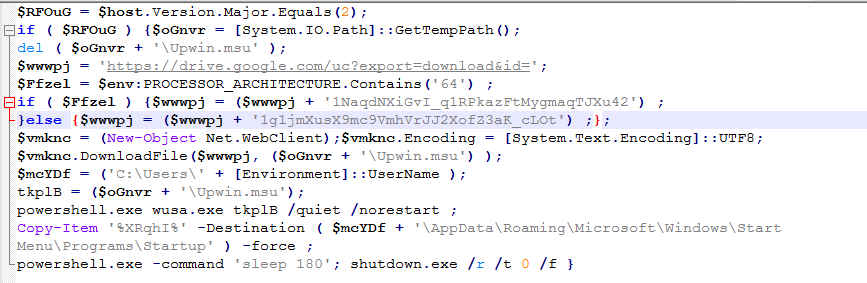
</a>
 
It then disables SSL/TLS certificate validation and sets the protocol to TLS 1.2, allowing the system to download the next stages.
 
<a href="Screenshots/njrat7.png"> 
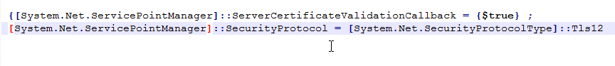
</a>
 
It then downloads a text file named `DLL01.txt` from an FTP site using the provided username and password.
 
<a href="Screenshots/njrat8.png"> 
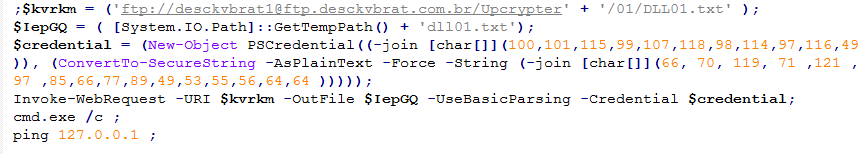
</a>
 

 
Finally, it reads the text file, converts it into an array, replaces certain characters, and then retrieves and executes the code.
 
<a href="Screenshots/njrat9.png"> 
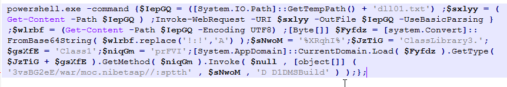
</a>
 
From there, I have two pivot points: the text file and the Pastebin site. These ultimately lead to other Pastebin sites, which then redirect to another site.
 
<a href="Screenshots/njrat10.png"> 
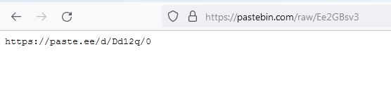
</a>
 
<a href="Screenshots/njrat10_1.png"> 
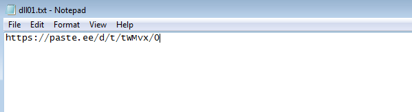
</a>
 
From there, I take the code from the paste[.]ee site and input it into CyberChef. It's fairly easy to tell that this is likely Base64-encoded data in reverse. CyberChef confirms this, and the resulting file is the njRAT executable.
 
<a href="Screenshots/njrat11.png"> 
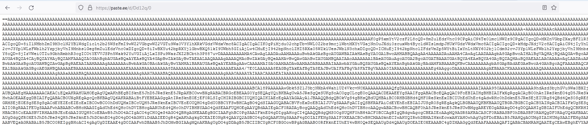
</a>
 
<a href="Screenshots/njrat11_1.png"> 
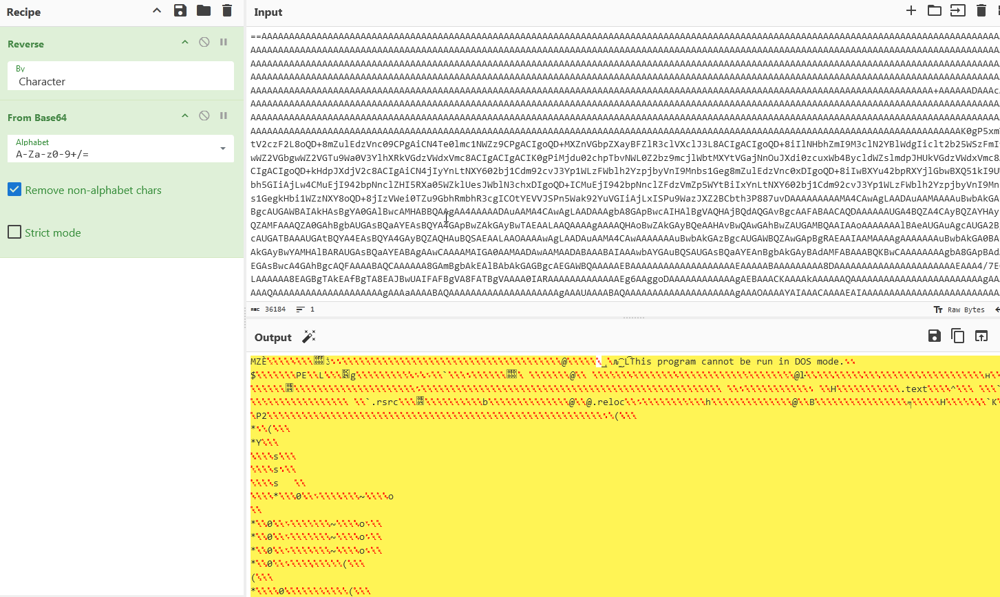
</a>
 
Luckily, the file is not packed and is fairly easy to analyze, making it simple to extract the configuration:
 
<a href="Screenshots/njrat12.png"> 
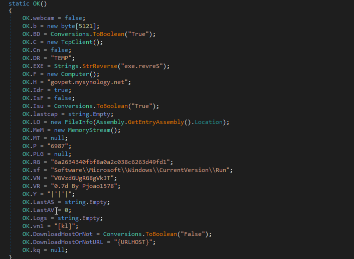
</a>
 

