

A recent sample of AsyncRat, leveraging Node.exe and AutoHotKeys.exe. The attack vector initiated with a BestBuy-themed email with a malicious link. This sample also deployed various tools to steal data.

Link downloads ISO
<a href="Screenshots/AsyncRat1.png"> 
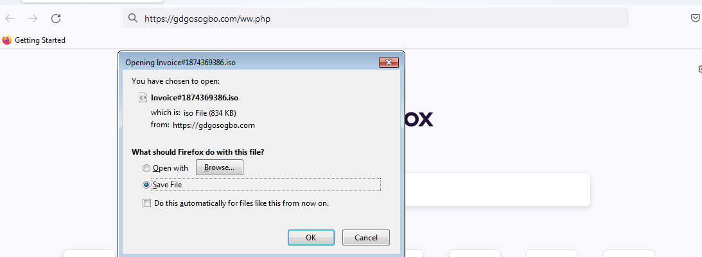
</a>

ISO contained WSF
<a href="Screenshots/AsyncRat2.png"> 
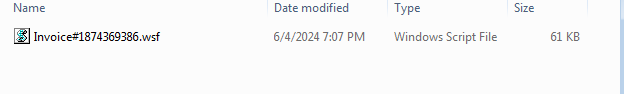
</a>

WSF file was lightly obfuscated
<a href="Screenshots/AsyncRat3.png"> 
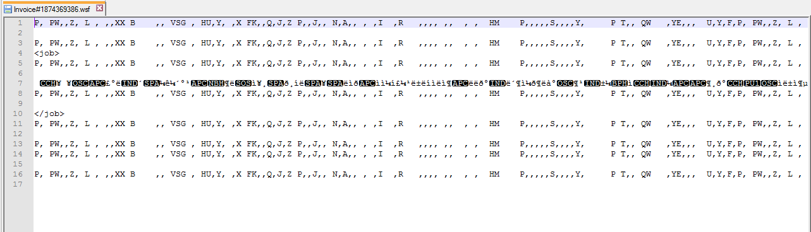
</a>

Cleaned up, we can see its using strings from a site
<a href="Screenshots/AsyncRat4.png"> 
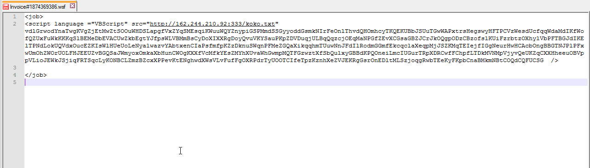
</a>

Again, lightly obfuscated
<a href="Screenshots/AsyncRat5.png"> 
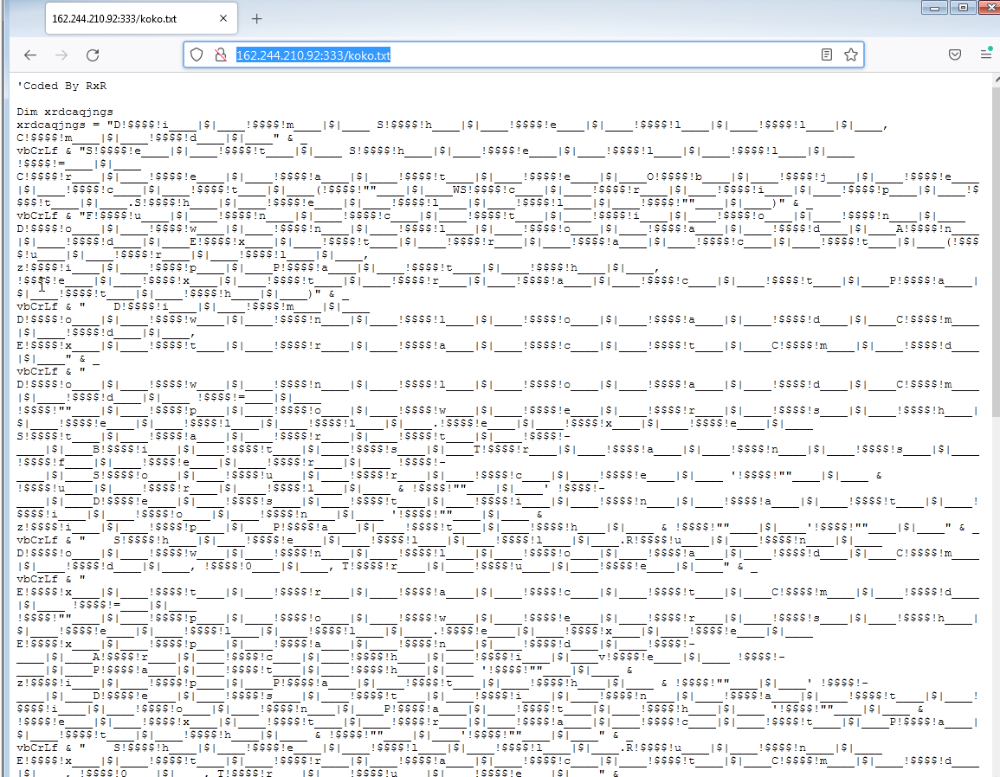
</a>

After cleaning up the obfuscated we see it's pretending to download a jpg file which is actually a ZIP file. This file is stored at C:\Users\Public\bbbb.zip and then extracted to the Public directory. Additionally, a legitimate AutoHotkey copy is downloaded as chrome.zip and also extracted to the Public directory.
<a href="Screenshots/AsyncRat6.png"> 
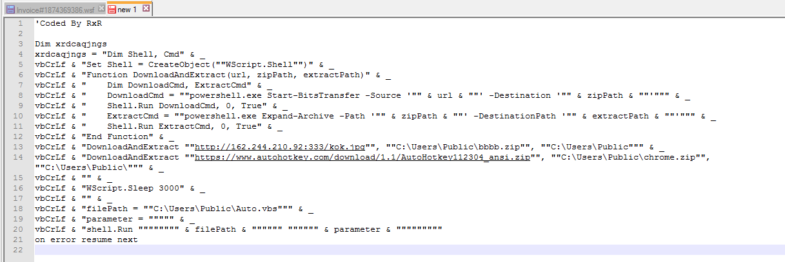
</a>

The ZIP file contains a combination of VBS, JS, BAT, AHK, and Hex Arrays.
<a href="Screenshots/AsyncRat7.png"> 
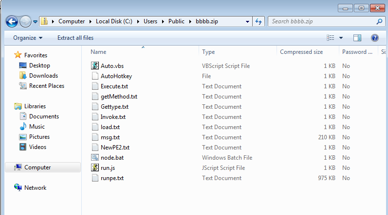
</a>

From above, we see the first thing it executes is "Auto.vbs". More obfuscation. More cleaning up, shows it opens node.bat and runs the .ahk file (AutoHotKey).
<a href="Screenshots/AsyncRat8.png"> 
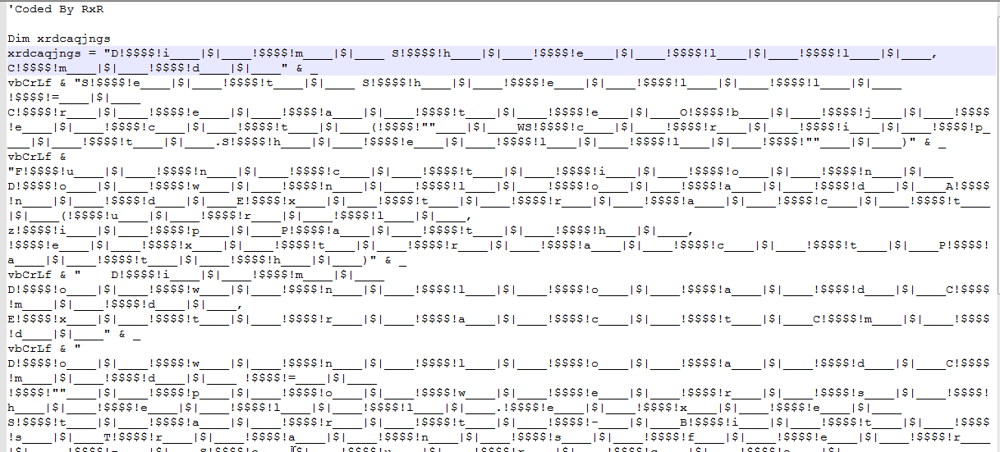
</a>
<a href="Screenshots/AsyncRat9.png"> 
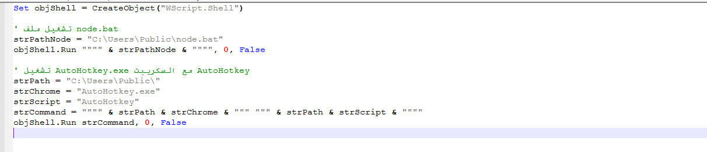
</a>

Looking at node.bat, it copies the ahk file to Documents and creates a scheaduled task
<a href="Screenshots/AsyncRat10.png"> 
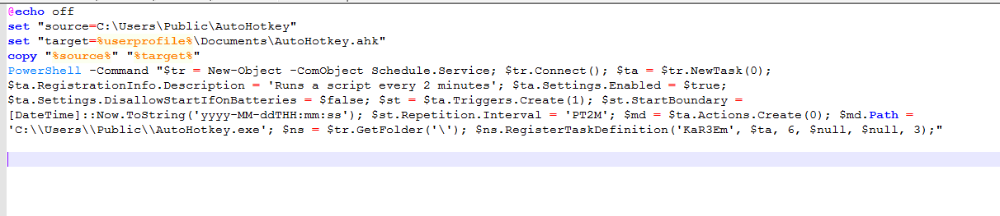
</a>

The AHK file executes a PowerShell command utilizing BitsTransfer to download Node.exe. After the download, it executes Node.exe with the "run.js" script, which is part of the "bbbb.zip" file.
<a href="Screenshots/AsyncRat11.png"> 
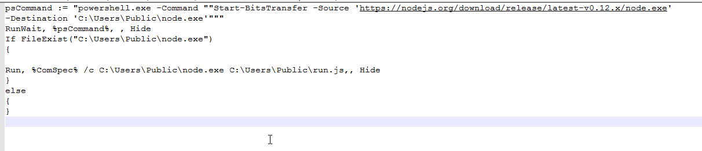
</a>

The "run.js" script generates a PowerShell command that incorporates additional files from "bbbb.zip" along with "aspnet_compiler.exe" to execute the payload.
<a href="Screenshots/AsyncRat12.png"> 
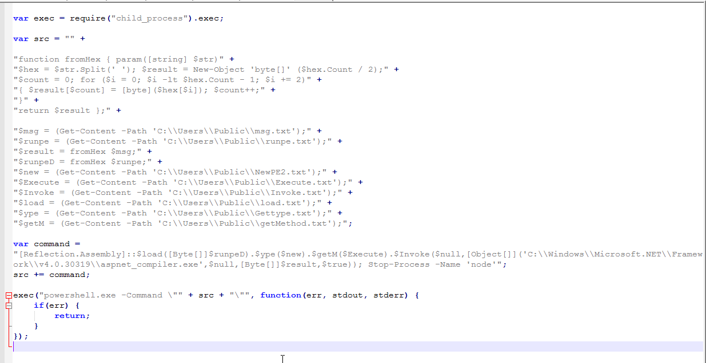
</a>

From there we can see it communicating with the AsyncRat C2
<a href="Screenshots/AsyncRat17.png"> 
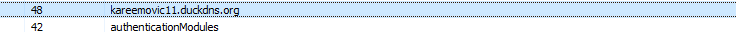
</a>

After inspecting the data further, I noticed additional commands and files being generated by "aspnet_compiler.exe". Among these, I found tools like StromKitty, XenArmor, and WebBrowserPassView being utilized.
<a href="Screenshots/AsyncRat13.png"> 
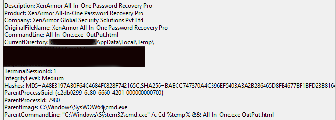
</a>
<a href="Screenshots/AsyncRat14.png"> 
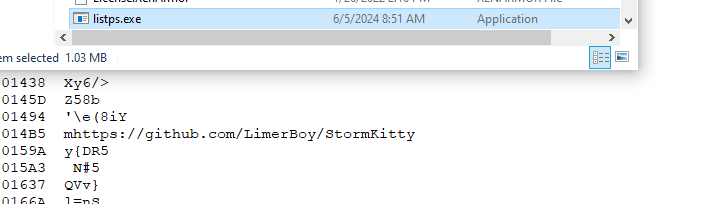
</a>
<a href="Screenshots/AsyncRat18.png"> 
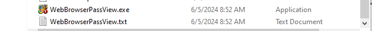
</a>

XenArmor results are being saved to:
 
%temp%/output.html
KeyFile - %temp%/License.XenArmor

WebBrowserPassView results are being saved to:
 %temp%/WebBrowserPassView.txt

StormKitty results are being saved to:
 AutoFill - Public\listautofill.txt
 Bookmarks - Public\listbmark.txt
 Cookies - Public\listcookie.txt
 CrediCard Numbers - Public\listcredit.txt
 History - Public\listhist.txt 
 Keylogger - %temp%/Log.tmp

StormyKitty "listcredit.txt" is looking for the following: 
<a href="Screenshots/AsyncRat16.png"> 
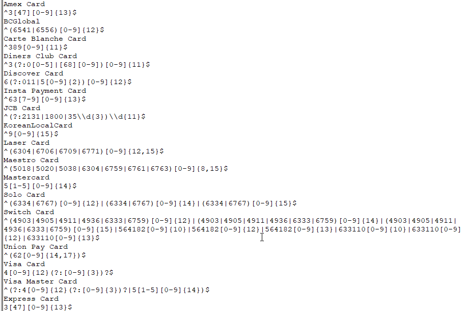
</a>