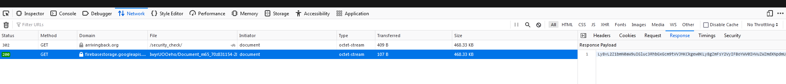

Noticed a few PDF that ultimately lead to Latrodectus in circulation. Decided to take a look and see what IOCs I could find. Here's the process I went through.

Starting point a PDF that contained a link:
 

 

Went to VirusTotal, searched by main_icon_hash and file name. Which gave me more samples:
 

 

Downloaded the files and extracted all the URLs from each PDF using a script I previously created:
 

 

Looking at the sites, each one contained the same source code:
 

 

From there, I returned to VirusTotal and searched using the body hash (96296d63308cf90f44477f24d92a5b34bc6953d4710c66679e1255f2a8b4fcfc), which gave me some more URLs to look at:
 

 

All URLs contained "wp-content/plugins" and "-private-files/shared". With this, I searched VirusTotal for "entity:url url:_/wp-content/plugins/_-private-files/shared/", which gave me 108 URLs:
 

 

I performed manual checks on over 50 of these URLs, all of which directed to the next stage, an obfuscated JS file:
 

 

Before diving into the JS file, it's worth mentioning that when reviewing the network connections, the website was communicating with arrivingback[.]org, a domain registered only a few days ago. This domain appears to redirect to the Firebase Storage site:
 

 

Alright, let's return to the JS files. All the files I downloaded followed the naming pattern (Document_.*_[0-9]{2}[a-z]{1}[0-9]{6}-[0-9]{2}[a-z]{1}[0-9a-z]{9,10}-[0-9]{4}[a-z]{1}[0-9]{1}.js). Upon inspecting the JS file, it seems to contain several commented-out lines:
 

 

Decided to remove all the committed out lines:
 

 

Ugh. Well, that's not going to work. Looks like it's reading through the file looking for lines with "////" and adding it to 'd'.I went back and commented out 'h();' to prevent it from executing. Then, I added "WScript.Echo(d);" to display the contents. Now, it's evident that it's downloading an MSI file. I repeated this process with all the other downloaded files, and they all had the same path configured:
 

 

The MSI unpacks a DLL to AppData\Local\sharepoint\360total.dll and runs with the entry point "homq". This will then spawn a child process which connects to the c2 server:
 

 
 

 
 

 