
I'm providing an update to my previous Latrodectus post. Here are additional pivot points I utilized and some searches that might be worth watching.

In my previous post, I mentioned pivoting on "-private-files/shared". However, after monitoring for more sites created with the same body hash, I observed a change from "files" to "fls":
 
<a href="Screenshots/LatVT1"> 
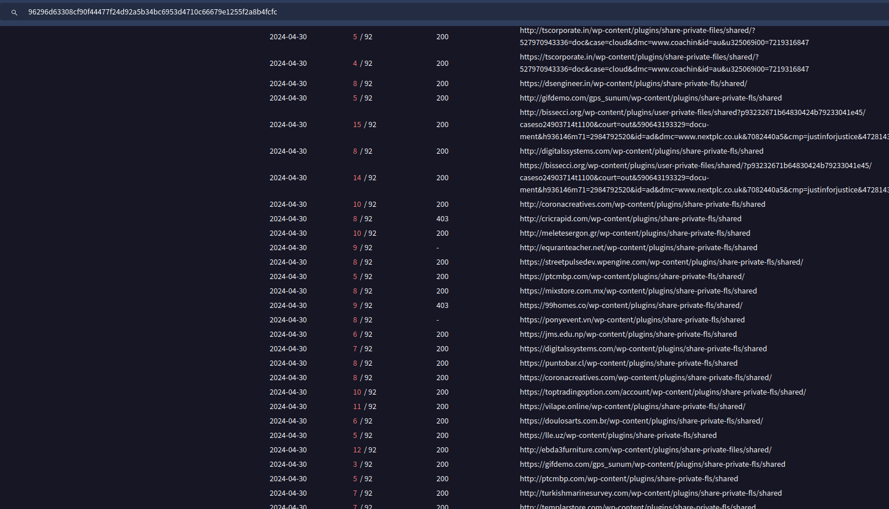
</a>
 
When visiting some of these sites, I found another change in the security check site. Previously, they were using arrivingback[.]org/security_check/, a domain registered on 4/24/2024. They switched to using dimozti1[.]org/security_check, another domain also created on 4/24/2024:
 
<a href="Screenshots/LatVT2"> 
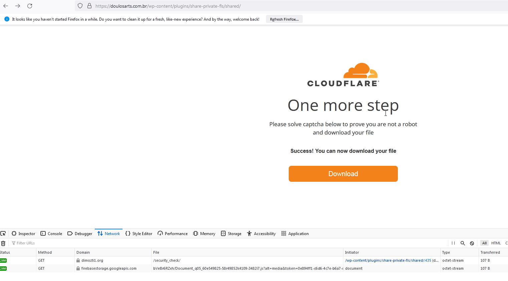
</a>
 
<a href="Screenshots/LatVT2_1"> 
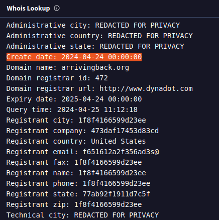
</a>
 
<a href="Screenshots/LatVT2_2"> 
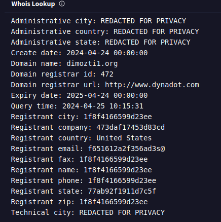
</a>
 
 
I then noticed that both of these domains have been resolving to the same IP, 193[.]106[.]174[.]210. When examining this IP in VirusTotal, it appears to have a history of malicious activity:
 
<a href="Screenshots/LatVT3"> 
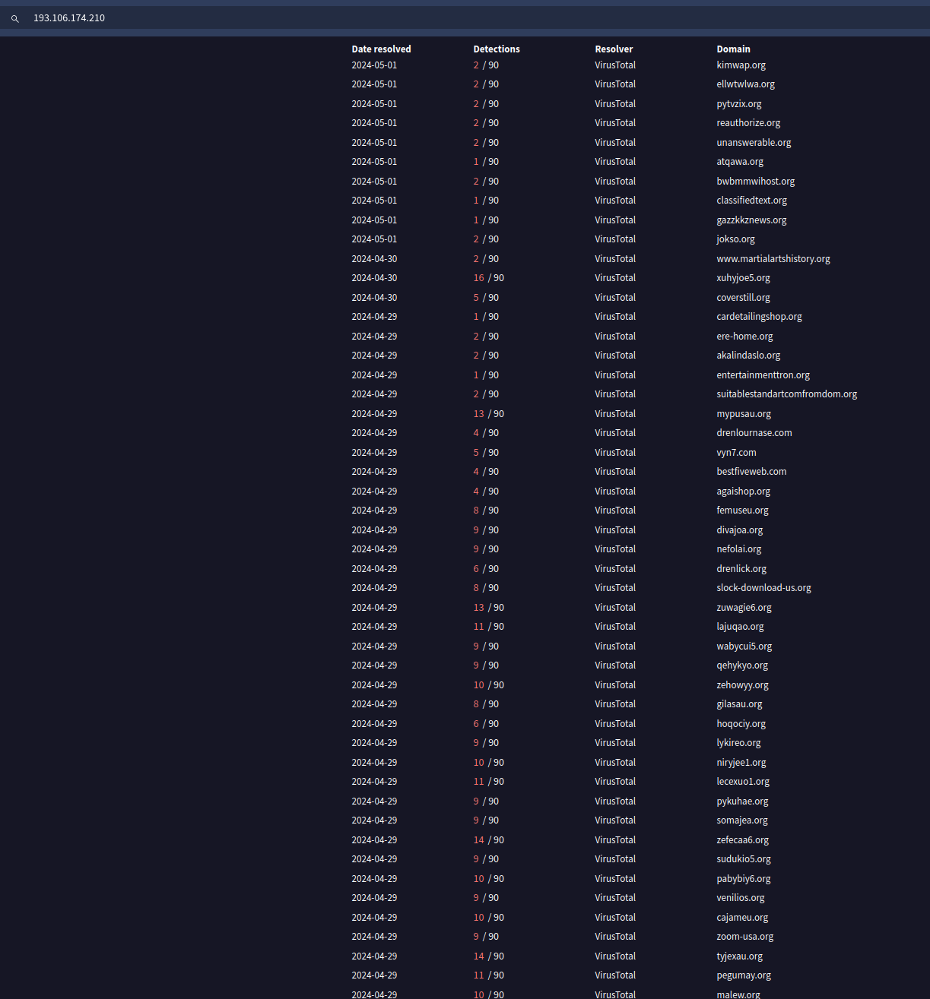
</a>
 
While the previous findings were intriguing, I reached a point where progress seemed halted. Rather than broadening my search, it seemed that I narrowed it to one IP. I decided to look at both arrivingback[.]org/security_check/ and dimozti1[.]org/security_check using urlscan, hoping to uncover new leads. I found that both sites were redirecting to a PDF hosted on harvardlawreview[.]org:
 
<a href="Screenshots/LatVT4"> 
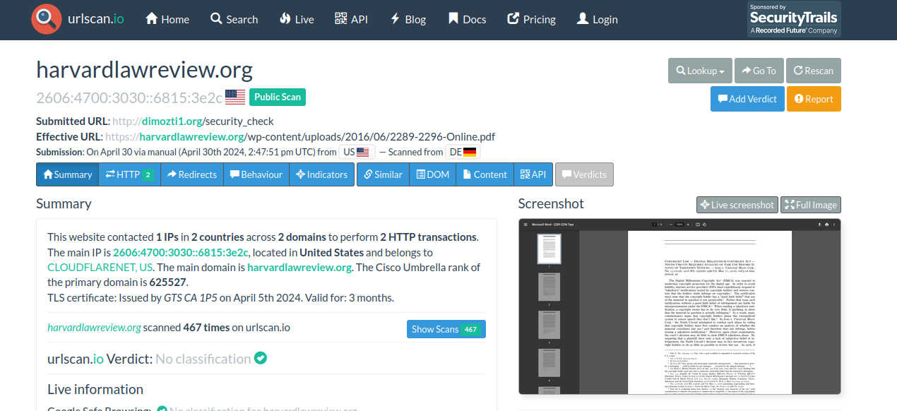
</a>
 
<a href="Screenshots/LatVT4_1"> 
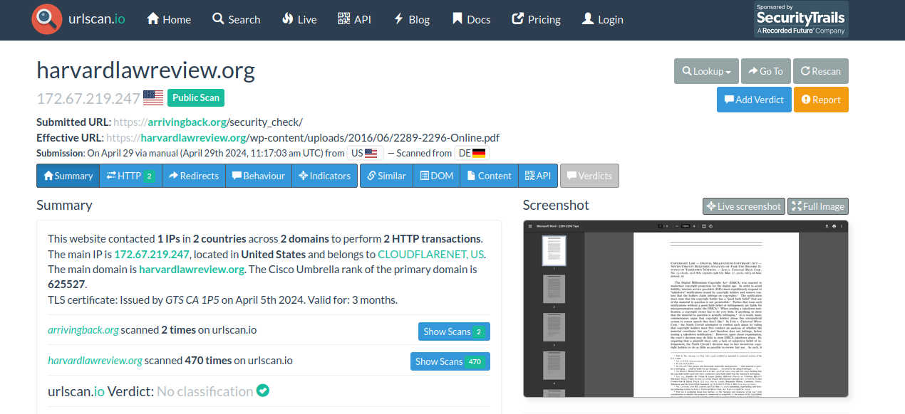
</a>
 
<a href="Screenshots/LatVT4_2"> 
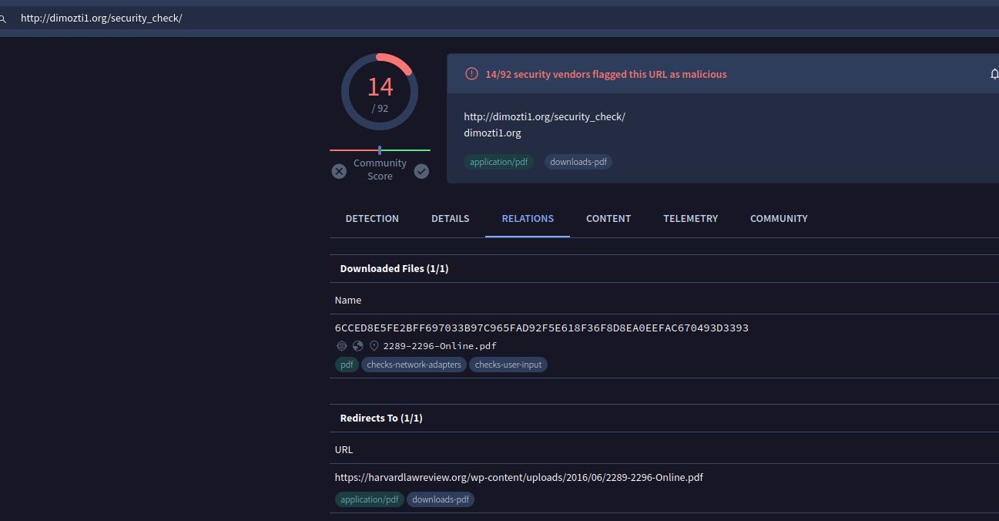
</a>
 
<a href="Screenshots/LatVT4_3"> 
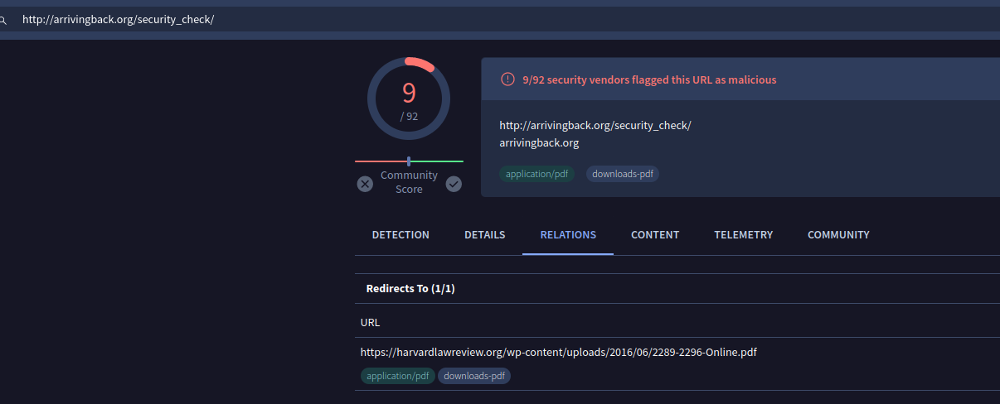
</a>
 
Returning to VirusTotal, I conducted a search for URLs that redirected to the PDF hosted on harvardlawreview. The results returned some interesting URLs:
 
<a href="Screenshots/LatVT5"> 
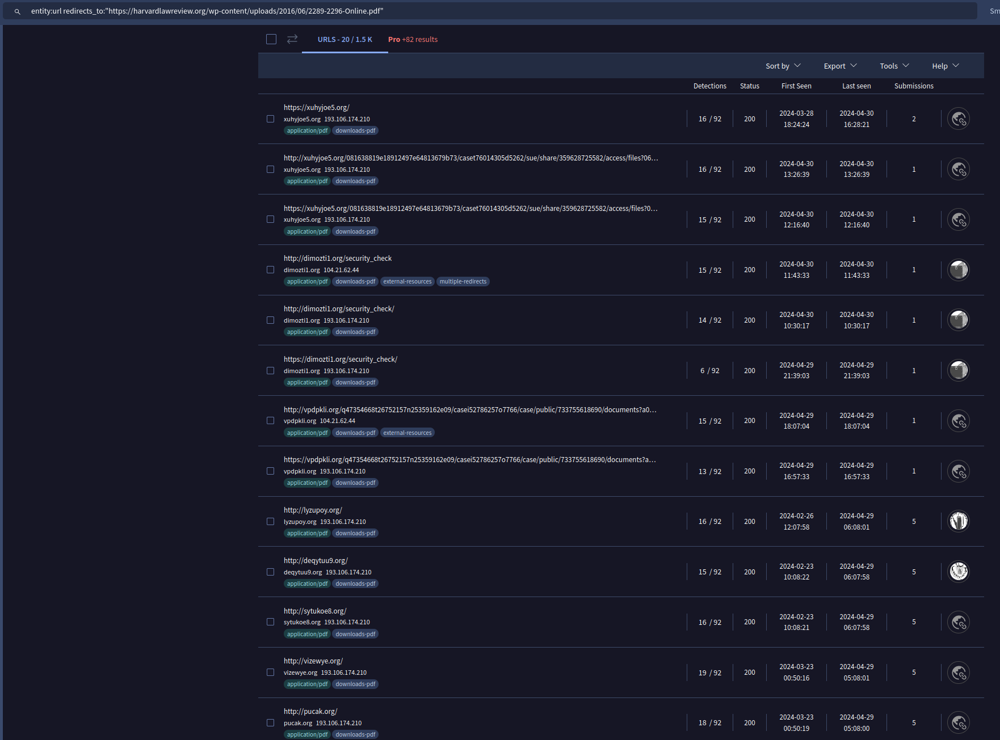
</a>
 
This seemed like the ending point, but out of curiosity, I decided to search for URLs redirecting to the PDF containing "/security_check/"-the pattern observed in the two previous URLs:
 
<a href="Screenshots/LatVT6"> 
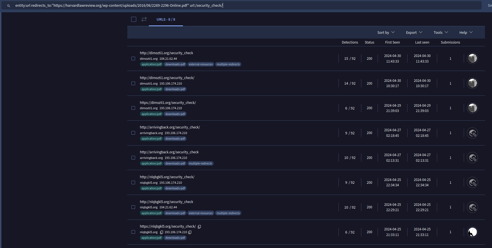
</a>
 
The search didn't yield an ton of results, but it did uncover one additional domain. Looking at the comments of the additional domain, it seems I'm on the right trail:
 
<a href="Screenshots/LatVT7"> 
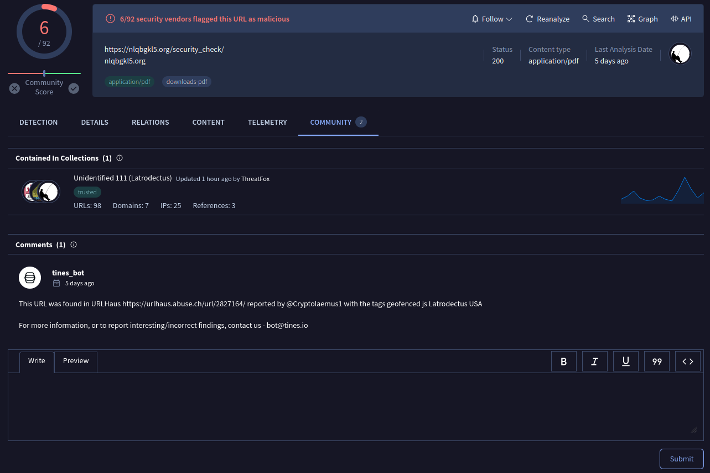
</a>
 

<U>Some VT searches that I'll continue to monitor</u>

<b>Relations to body hash, this will help monitor for changes to URLs:</b>
 
96296d63308cf90f44477f24d92a5b34bc6953d4710c66679e1255f2a8b4fcfc
  
<b>URLs that contain the same redirect and uri:</b>
 
entity:url redirects_to:"https://harvardlawreview.org/wp-content/uploads/2016/06/2289-2296-Online.pdf" url:/security_check/
  
<b>Samples using entry point "homq" which has been used on the previous samples:</b>
 
behaviour_processes: *dll, homq