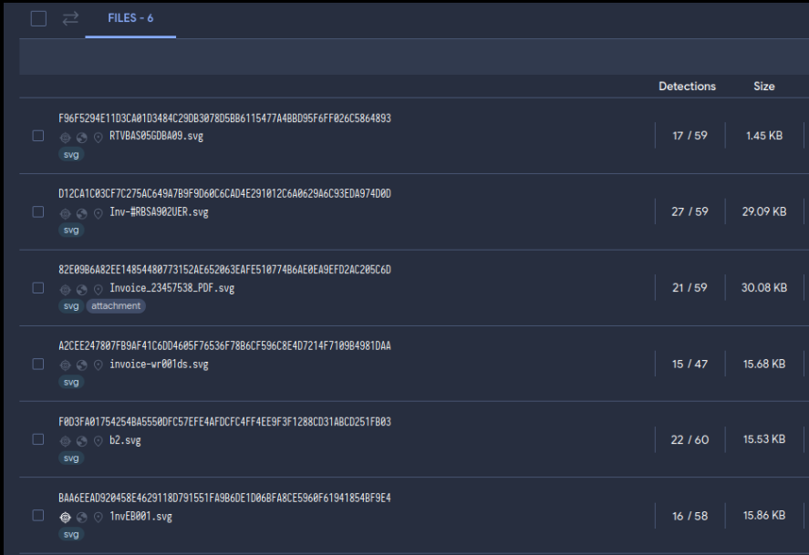
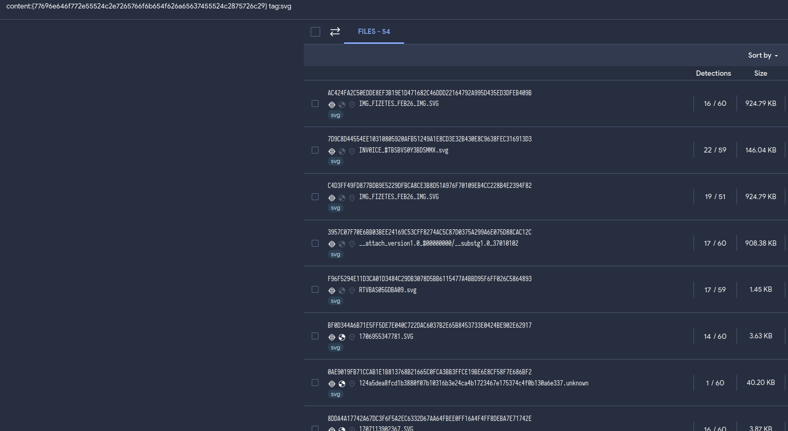
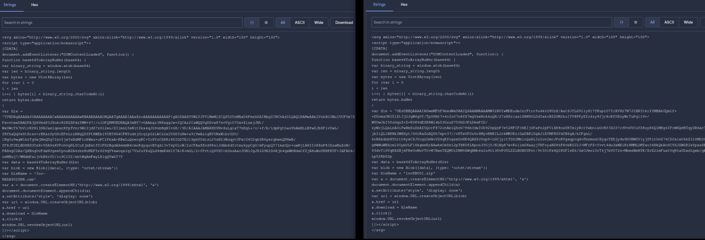
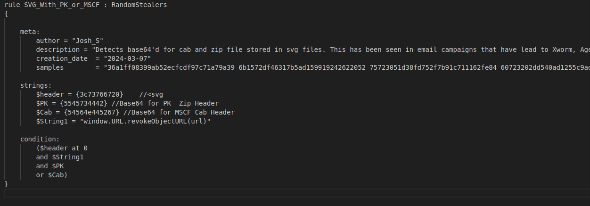
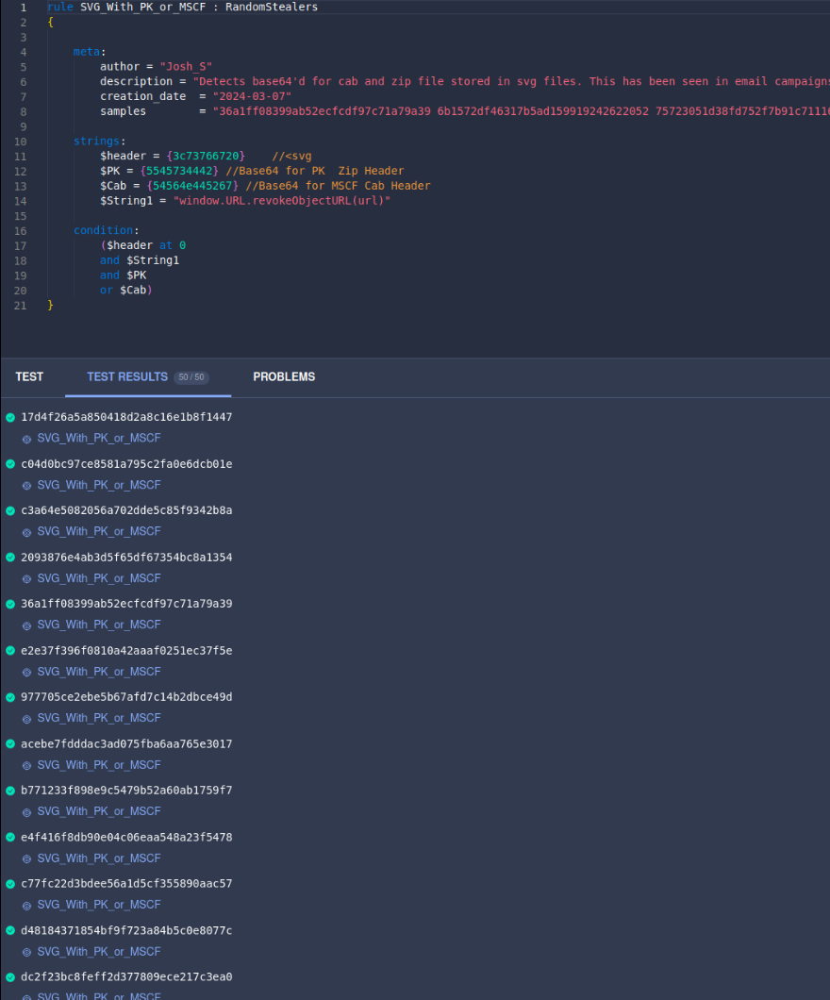

This is one from a while back. But still some good information. I was seeing lots of emails with svg attachments. Most lead to stealers/rats like AgentTesla and XWorm. Here is a yara rule I came up with and the process I went through. 

Starting point was a handful of svg attachments found in circulation. From the handful of attachments, there were six unique hashs I could start with. I tossed these into VirusTotal:

Next, I started digging into the strings. There were a lot of unique strings, but I decided to focus on "window.URL.revokeObjectURL(url)" as it seems like a unique string for an SVG file. The results looked very promising. I put these 50 hashes in my back pocket for future use.

Started going through the samples and noticed that they all had embedded base64'd ZIP or cab files:

 Decided to make a rule based on this information(svg header, base64'd zip or cab and window.URL.revokeObjectURL string):
 

I then set up a VT hunt. Went back to the 50 hashes I saved from earlier to test against. Success!:
 

<a href="https://github.com/mcsx03/mcsx03.github.io/blob/main/Yara/SVG_With_PK.yara">Link to Yara rule</a>
 